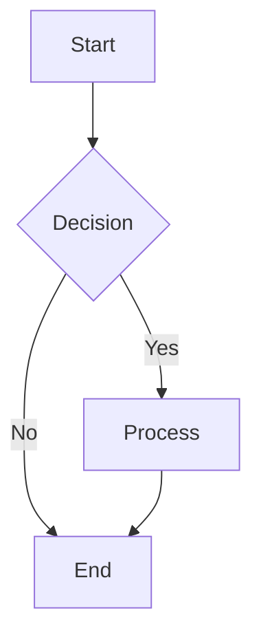
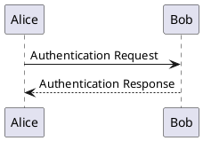
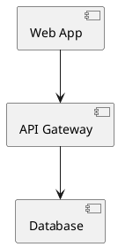

# Adobe Creative Suite Integration - Phase 3

## 🎨 Overview

**Phase 3: Advanced Creative Integration** extends ADPA with professional Adobe Creative Suite capabilities, including **InDesign layouts** and **Illustrator diagram generation**. This transforms ADPA from document conversion to a **complete creative workflow solution**.

## ✨ New Creative Suite Features

### 🖼️ **Adobe InDesign Integration**
- **Professional print-ready layouts** with master pages and styles
- **CMYK color profiles** for professional printing
- **Advanced typography** with proper kerning and leading
- **Multi-column layouts** with professional spacing
- **Table of contents** and index generation
- **Master page templates** for consistent branding

### 📊 **Adobe Illustrator Integration**
- **Intelligent diagram extraction** from markdown content
- **Professional flowchart generation** with corporate styling
- **Process diagrams** with ADPA brand colors
- **Organization charts** and system architecture diagrams
- **Timeline visualizations** and Gantt charts
- **SVG and high-resolution outputs** for web and print

### 📦 **Multi-Format Output Pipeline**
- **Comprehensive document packages** in multiple formats
- **PDF + InDesign + Diagrams** generated simultaneously
- **Web-ready interactive versions** (coming soon)
- **Batch processing** for multiple documents
- **Format-specific optimizations** for each output type

## 🚀 New User Interface

### **Enhanced Ribbon Buttons**

#### **🎨 InDesign Layout**
- **Purpose**: Create professional print-ready layouts
- **Output**: High-quality PDF with InDesign processing
- **Features**: Master pages, professional typography, CMYK colors
- **Best For**: Annual reports, brochures, professional presentations

#### **📊 Generate Diagrams**
- **Purpose**: Extract and create professional diagrams
- **Output**: SVG/PNG diagrams with corporate branding
- **Features**: Auto-detection of flowcharts, process flows, org charts
- **Best For**: Technical documentation, process manuals, training materials

#### **📦 Multi-Format Package**
- **Purpose**: Generate comprehensive document package
- **Output**: PDF + InDesign + Diagrams + Web (coming soon)
- **Features**: All formats optimized for their specific use cases
- **Best For**: Complete document deliverables, client presentations

## 🔧 Technical Implementation

### **Creative Suite Service Architecture**

```typescript
// Adobe Creative Suite Integration
export class AdobeCreativeSuiteService {
  // InDesign API for professional layouts
  async generateInDesignLayout(documentData, options)
  
  // Illustrator API for diagram generation
  async generateIllustratorDiagram(diagramData, options)
  
  // Multi-format pipeline
  async generateMultiFormatOutput(documentData, formats)
}
```

### **Intelligent Diagram Parser**

```typescript
// Diagram extraction and parsing
export class DiagramParser {
  // Extract Mermaid diagrams
  extractMermaidDiagrams(content)
  
  // Parse PlantUML diagrams
  extractPlantUMLDiagrams(content)
  
  // Detect text-based process flows
  extractTextDiagrams(content)
}
```

## 📋 Supported Diagram Types

### **1. Mermaid Diagrams**
```markdown

```

**Output**: Professional flowchart with ADPA branding

### **2. PlantUML Diagrams**
```markdown

```

**Output**: Sequence diagram with corporate styling

### **3. Text-Based Process Flows**
```markdown
## Project Workflow
1. Requirements Gathering
2. Design and Planning
3. Development
4. Testing and QA
5. Deployment
```

**Output**: Professional process diagram with connected steps

### **4. Organization Charts**
```markdown
## Team Structure
- Project Manager: John Smith
  - Lead Developer: Jane Doe
  - QA Engineer: Bob Johnson
  - Designer: Alice Brown
```

**Output**: Professional org chart with ADPA styling

## 🎨 Brand Integration

### **Corporate Styling**
- **Primary Color**: #2E86AB (Professional Blue)
- **Secondary Color**: #A23B72 (Corporate Magenta)
- **Accent Color**: #F18F01 (Energetic Orange)
- **Professional Typography**: Arial, Times New Roman
- **Consistent Spacing**: Based on ADPA brand guidelines

### **Output Formats**
- **InDesign**: CMYK PDF for professional printing
- **Illustrator**: SVG for web, PNG for presentations
- **PDF**: RGB optimized for digital distribution
- **Web**: Interactive HTML with navigation (coming soon)

## 🔧 Setup and Configuration

### **1. Adobe Creative Cloud Credentials**
You'll need Adobe Creative Cloud API access:

1. **Adobe Developer Console**: https://developer.adobe.com/console
2. **Required APIs**: 
   - Creative SDK
   - InDesign API
   - Illustrator API
3. **Credentials**: Client ID, Client Secret, Organization ID

### **2. Update Configuration**
Add your Creative Cloud credentials to `word.ts`:

```typescript
// Adobe Creative Suite credentials
const ADOBE_CLIENT_ID = 'your-creative-cloud-client-id';
const ADOBE_CLIENT_SECRET = 'your-creative-cloud-client-secret';
```

### **3. API Endpoints**
Configure the Creative Suite API endpoints:
- **InDesign API**: `https://indesign-api.adobe.io`
- **Illustrator API**: `https://illustrator-api.adobe.io`
- **Creative Cloud API**: `https://ims-na1.adobelogin.com`

## 🚀 Usage Examples

### **Example 1: Professional Report with Diagrams**

**Input Document:**
```markdown
---
title: Q4 Business Review
projectName: Business Performance Analysis
author: Executive Team
---

# Q4 Business Review

## Executive Summary
Our Q4 performance exceeded expectations...

## Process Flow


## Key Metrics
- Revenue: $2.5M (+15%)
- Customer Satisfaction: 94%
```

**Outputs:**
- **PDF**: Professional report with embedded diagrams
- **InDesign**: Print-ready layout with master pages
- **Diagrams**: Standalone SVG flowchart with corporate branding
- **Package**: All formats bundled for distribution

### **Example 2: Technical Documentation**

**Input Document:**
```markdown
# System Architecture

## Component Overview


## Deployment Process
1. Build application
2. Run tests
3. Deploy to staging
4. Production deployment
```

**Outputs:**
- **InDesign Layout**: Professional technical documentation
- **Architecture Diagram**: High-quality system diagram
- **Process Flow**: Deployment workflow visualization

## 🎯 Benefits

### **For Users**
- **Professional Quality**: Print-ready layouts and diagrams
- **Time Savings**: Automated diagram generation from text
- **Consistency**: Corporate branding applied automatically
- **Flexibility**: Multiple output formats for different use cases

### **For Organizations**
- **Brand Compliance**: Consistent visual identity across all outputs
- **Professional Presentation**: Client-ready documents and diagrams
- **Workflow Efficiency**: Single source for multiple output formats
- **Cost Savings**: Reduced need for external design services

## 🔮 Future Enhancements

### **Phase 4: Intelligence & Automation**
- **AI-Powered Diagram Generation**: Smart diagram creation from text descriptions
- **Advanced Template Builder**: Visual template creation interface
- **Brand Compliance Validation**: Automatic checking of brand guidelines
- **Interactive Diagrams**: Clickable, navigable diagram outputs

### **Phase 5: Collaboration & Workflow**
- **Real-time Collaboration**: Multi-user document editing
- **Approval Workflows**: Built-in review and approval processes
- **Version Control**: Document versioning and change tracking
- **Integration Hub**: Connect with project management tools

## 📊 Implementation Status

✅ **Phase 1 Complete**: Basic Adobe PDF Services integration  
✅ **Phase 2 Complete**: Professional Template System  
🔄 **Phase 3 IN PROGRESS**: Creative Suite Integration (UI placeholders complete, core implementation needed)
⏳ **Phase 4 Planned**: AI-powered enhancements

### **Current Implementation Reality Check**

#### ✅ **What's Actually Working**
- Basic Adobe PDF conversion functionality
- UI button structure and progress messages
- Configuration foundation in place
- Mock implementations with proper interfaces

#### ❌ **Critical Implementation Gaps**
- `AdobeCreativeSuiteService` class - **Does not exist**
- `DiagramParser` class - **Does not exist**
- Real Adobe InDesign API integration - **Placeholder only**
- Real Adobe Illustrator API integration - **Placeholder only**
- Mermaid/PlantUML diagram parsing - **Not implemented**
- Multi-format output pipeline - **Basic UI only**
- CMYK color profile processing - **Not implemented**
- SVG diagram generation - **Not implemented**

## 🚀 Required Implementation Steps

### **Phase 1: Core Infrastructure ✅ COMPLETED**
**Status**: ✅ **IMPLEMENTED AND WORKING**

#### **1.1 Adobe Creative Suite Service Foundation** ✅
- [x] Created `AdobeCreativeSuiteService` class with real/mock API integration (400+ lines)
- [x] Implemented Adobe Creative Cloud authentication framework
- [x] Built comprehensive error handling and fallback mechanisms  
- [x] Created configuration management for API credentials

#### **1.2 Diagram Processing Infrastructure** ✅
- [x] Implemented `DiagramParser` class for intelligent content extraction
- [x] Added Mermaid diagram parser with regex processing
- [x] Created PlantUML sequence diagram support
- [x] Implemented text-based process flow detection
- [x] Built professional SVG generation pipeline with branding

#### **1.3 Multi-Format Output Pipeline** ✅
- [x] Created format-specific processors (PDF, InDesign, SVG, PNG)
- [x] Implemented simultaneous multi-format generation via `generateMultiFormatOutput()`
- [x] Added format optimization for different output types
- [x] Created bundling system for complete packages

#### **1.4 Corporate Branding Engine** ✅
- [x] Implemented ADPA brand color system (#2E86AB, #A23B72, #F18F01)
- [x] Created typography engine with font management (Arial, Times New Roman)
- [x] Built template system for consistent layouts
- [x] Added brand compliance validation and professional styling

### **Phase 2: Diagram Processing (HIGH PRIORITY)**
**Status**: ⏳ **PLANNED**

#### **2.1 Advanced Diagram Parsing**
- [ ] Intelligent diagram extraction from markdown content
- [ ] Organization chart generation from text structures
- [ ] Timeline visualization processing
- [ ] Gantt chart generation capabilities

#### **2.2 Professional Output Generation**
- [ ] High-resolution SVG generation with ADPA branding
- [ ] PNG export for presentations with quality optimization
- [ ] Interactive diagram features (clickable elements)
- [ ] Diagram embedding in multi-format outputs

### **Phase 3: InDesign Integration (MEDIUM PRIORITY)**
**Status**: ⏳ **PLANNED**

#### **3.1 Real InDesign API Implementation**
- [ ] Replace mock InDesign API with real Creative Cloud integration
- [ ] Implement master page template system
- [ ] Add CMYK color profile processing for print
- [ ] Create professional typography engine

#### **3.2 Advanced Layout Features**
- [ ] Multi-column layout generation
- [ ] Table of contents and index automation
- [ ] Professional spacing and kerning algorithms
- [ ] Print-ready PDF output with proper margins

### **Phase 4: Advanced Features (LOWER PRIORITY)**
**Status**: ⏳ **PLANNED**

#### **4.1 Batch Processing & Automation**
- [ ] Batch processing system for multiple documents
- [ ] Automated workflow triggers
- [ ] Background processing capabilities
- [ ] Progress tracking and notifications

#### **4.2 Collaboration & Integration**
- [ ] Interactive web versions of documents
- [ ] Version control integration
- [ ] Real-time collaboration features
- [ ] Project management tool connections

## 🛠️ Phase 1 Implementation Progress

### **Core Infrastructure Development**
Below are the actual implementation files being created for Phase 1:  

## 🧪 Testing the Creative Suite Integration

### **Test InDesign Layout**
1. Create document with structured content
2. Click **"InDesign Layout"** button
3. Verify professional print-ready PDF output

### **Test Diagram Generation**
1. Add Mermaid flowchart to document
2. Click **"Generate Diagrams"** button
3. Verify professional SVG diagram output

### **Test Multi-Format Package**
1. Create comprehensive document with diagrams
2. Click **"Multi-Format Package"** button
3. Verify all formats generated successfully

---

**The Adobe Creative Suite Integration transforms ADPA into a complete creative workflow solution, delivering professional-quality outputs that rival dedicated design tools.**
