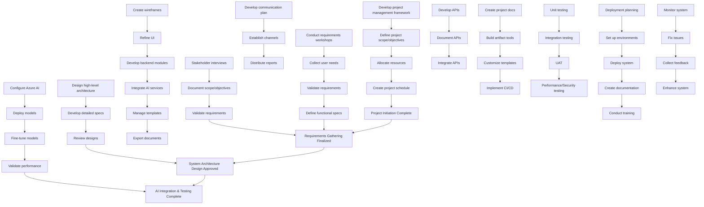

# AI-Generated Project Schedule Network Diagram (Description & Mermaid)

Certainly! Based on the provided Activity List and Milestone List, here's a brief overview of the project's main activity sequences and their dependencies, followed by a Mermaid.js syntax diagram illustrating the logical flow and dependencies.

---

### 1. Project Main Activity Sequences and Paths

**Project Initiation Phase:**
- Starts with activities **1.1-A1** to **1.1-A4**, establishing the project management framework, scope, resources, and schedule.
- These activities lead to the **Project Initiation Complete** milestone.

**Requirements Gathering Phase:**
- Follows with stakeholder engagement activities **1.2-A1** to **1.2-A3**.
- Finalizes with **1.2-A4** (Requirements Gathering Finalized milestone).
- Parallel activities include stakeholder communication planning (**1.3-A1** to **1.3-A3**).

**Requirements Analysis:**
- Activities **2.1-A1** to **2.1-A4** focus on requirements collection.
- These are followed by **2.2-A1** to **2.2-A4** for detailed analysis, leading to the **Requirements Gathering Finalized** milestone.

**System Design:**
- High-level architecture activities **3.1-A1** to **3.1-A3** set the foundation.
- Design of UI prototypes **3.2-A1** to **3.2-A3** follows.
- Backend AI integration **3.3-A1** to **3.3-A4**, and document/template management activities **3.4-A1** to **3.4-A3** and **3.5-A1** to **3.5-A3** support the prototype development.
- The **System Architecture Design Approved** milestone indicates completion of this phase.

**AI Integration & Development:**
- Activities **4.1-A1** to **4.2-A2** focus on deploying and fine-tuning AI models.
- API development and documentation **4.3-A1** to **4.3-A3** follow.
- Leads to the **AI Integration & Testing Complete** milestone.

**System Development & Documentation:**
- Project management document features **5.1-A1** to **5.1-A3**.
- Artifact tools **5.2-A1** to **5.2-A3**.
- Documentation and template customization **5.3-A1** to **5.3-A3**.
- Automation scripts and CI/CD pipelines **5.4-A1** to **5.4-A3**.
- These activities prepare the system for testing and deployment.

**Testing & Validation:**
- Unit testing **6.1-A1** to **6.1-A2**.
- Integration testing **6.2-A1** to **6.2-A2**.
- User Acceptance Testing **6.3-A1** to **6.3-A3** culminate in UAT sign-off.
- Performance and security testing **6.4-A1** to **6.4-A3** follow.

**Deployment & Training:**
- Deployment planning **7.1-A1** to **7.1-A2**.
- CI/CD deployment pipelines **7.2-A1** to **7.2-A2**.
- Actual deployment **7.3-A1** to **7.3-A2**.
- Documentation and training **7.4-A1** and **7.4-A2**.

**Post-Deployment & Closure:**
- Monitoring **8.1-A1** to **8.1-A2**.
- Issue resolution **8.2-A1** to **8.2-A2**.
- Feedback collection and system enhancement **8.3-A1** to **8.3-A2**.
- Project closure and review milestones mark the end.

---

### 2. Mermaid.js Graph Syntax

---

### Notes:
- Milestones are shown as nodes with labels like "Milestone1", "Milestone2", etc.
- Dependencies follow logical sequences, with arrows indicating flow.
- You can customize node shapes or styles further if needed, but this provides a clear logical flow of activities and dependencies.

Let me know if you'd like a more detailed diagram or specific activity groupings!