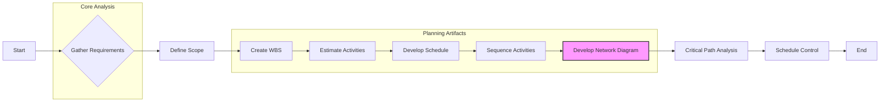

# Schedule Network Diagram

**Generated by Requirements Gathering Agent v2.1.1**  
**Category:** planning-artifacts  
**Generated:** 2025-06-05T18:30:45.337Z  
**Description:** PMBOK Schedule Network Diagram

---

**Explanation of Activities and their Dependencies:**

* **A (Start):** The project begins.
* **B (Gather Requirements):**  Requirements gathering is the initial step, defining the project's scope and objectives. This feeds into scope definition.
* **C (Define Scope):**  Clearly defines the project boundaries, deliverables, and acceptance criteria. This is necessary before detailed planning can begin.
* **D (Create WBS):**  The Work Breakdown Structure decomposes the project into smaller, manageable tasks.
* **E (Estimate Activities):** Each task in the WBS is assigned a duration estimate.
* **F (Develop Schedule):** A preliminary schedule is created based on activity durations.
* **G (Sequence Activities):**  Activities are sequenced logically, identifying dependencies between them. This is crucial for creating the network diagram.
* **H (Develop Network Diagram):** The network diagram visually represents the activities and their dependencies.  This is a key deliverable and is highlighted in the diagram.
* **I (Critical Path Analysis):** The critical path (the longest sequence of activities) is identified, highlighting activities that cannot be delayed without impacting the project's overall duration.
* **J (Schedule Control):**  Ongoing monitoring and control of the schedule throughout the project lifecycle.
* **K (End):** The project is completed.

This Mermaid diagram provides a simplified representation. A real-world project would have many more activities and dependencies, potentially requiring multiple diagrams to manage complexity.  The numbering and specific details would depend on the actual project plan.  The highlighted "Develop Network Diagram" task emphasizes its importance as a key deliverable within the broader project scheduling process.
