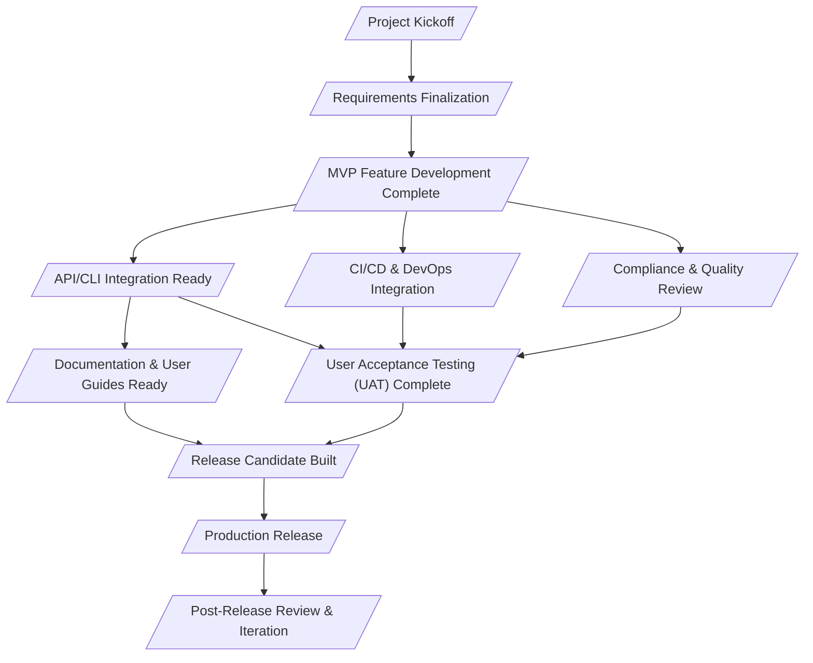

# AI-Generated Project Schedule Network Diagram (Description & Mermaid)

Certainly! Since the Activity List and Activity Attributes are **not provided**, I'll infer the most logical activity sequences and dependencies based on the Milestone List, milestone descriptions, and related Activity IDs. This will create a plausible project schedule network diagram.

---

## 1. Textual Overview of Project Activity Sequences

The "Requirements Gathering Agent" project follows a structured, sequential path with some parallelization in development and integration activities. The main activity sequences are:

1. **Project Initiation:**  
   The project begins with the **Project Kickoff**, aligning the team and confirming objectives.

2. **Requirements Gathering & Finalization:**  
   Activities for requirements elicitation and approval culminate in the **Requirements Finalization** milestone.

3. **Development Phase:**  
   - **MVP Feature Development** (core agent, CLI/API, AI integration, compliance basics) occurs.
   - **API/CLI Integration** and **CI/CD & DevOps Integration** run in parallel, following MVP progress.
   - **Compliance & Quality Review** is conducted after core features are built.

4. **Testing & Documentation:**  
   - **User Acceptance Testing (UAT)** and **Documentation & User Guides** proceed, leveraging completed features and integrations.

5. **Release Preparation:**  
   - Once UAT and documentation are complete, the **Release Candidate** is built and tested.

6. **Production Deployment:**  
   - The agent is released to production environments (**Production Release**).

7. **Post-Release Activities:**  
   - **Post-Release Review & Iteration** gathers feedback and plans improvements.

**Key Parallel Paths:**  
- Some integration and documentation activities can overlap with development and testing.
- Release prep depends on both UAT and documentation completion.

---

## 2. Mermaid.js Graph Syntax

Below is a Mermaid.js diagram representing the logical flow and dependencies between milestones (as nodes), using concise names.  
**Milestones are shown as rounded rectangles.**  
**Activity IDs are omitted for clarity, but could be added if desired.**

**Legend:**
- `/..."Milestone".../` = Milestone (rounded rectangle in Mermaid)
- Arrows indicate mandatory dependencies.

---

**Summary:**  
This network diagram illustrates the main sequential and parallel flows, highlighting how core development leads into integrations, reviews, testing, and eventual release, with clear milestone-based dependencies.  
Let me know if you need more detail, activity-level nodes, or further customization!