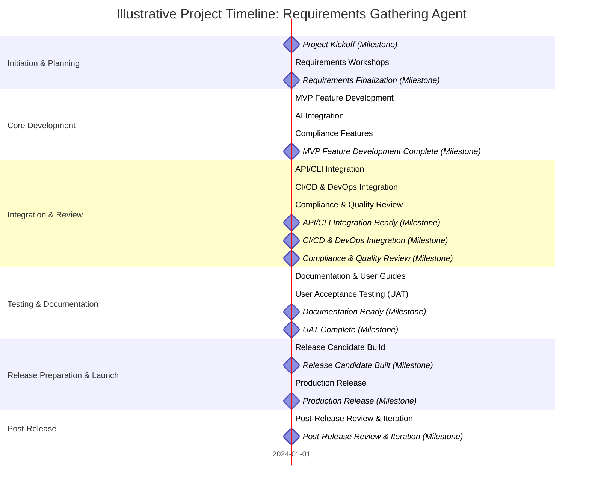

# AI-Generated Develop Schedule Input (PMBOK Planning)

Certainly! Below is a structured document that serves as a foundational input for the "Develop Schedule" process for the "Requirements Gathering Agent" project, incorporating your contextual information and required elements.

---

# Foundational Document for "Develop Schedule" Process  
**Project:** Requirements Gathering Agent

---

## 1. Summary of Key Scheduling Inputs

The project planning process has produced the following essential scheduling inputs:

- **Activity List & Attributes:** A detailed set of project activities, each with descriptive attributes and logical dependencies.
- **Relative Duration Estimates:** Each activity has an initial, relative estimate of effort (e.g., Small, Medium, Large).
- **Resource Estimates (Types):** Resource types (e.g., Developers, QA, Compliance, DevOps, Documentation) and their relative involvement are identified for each activity.
- **Network Diagram:** A visual depiction of activity sequencing and dependencies (see provided Mermaid diagram).
- **Milestone List:** Key project milestones have been defined, each mapped to related activities and WBS elements.
- **Scope:** The scope encompasses requirements gathering, development, integration, testing, documentation, release, and post-release review.

These inputs provide a robust basis for developing the detailed project schedule.

---

## 2. Proposed Phased Project Structure

Based on the WBS and milestone sequencing, the project can be logically structured into the following phases:

| Phase No. | Phase Name                    | Description                                                                            | Key Milestones/Deliverables                 |
|-----------|------------------------------|----------------------------------------------------------------------------------------|---------------------------------------------|
| 1         | Initiation & Planning         | Project kickoff, stakeholder alignment, requirements elicitation and approval           | Project Kickoff, Requirements Finalization   |
| 2         | Core Development              | MVP feature development, core integrations, compliance & quality features               | MVP Feature Development Complete            |
| 3         | Integration & Review          | API/CLI integration, CI/CD & DevOps, compliance/quality review                         | API/CLI Integration Ready, CI/CD Integration, Compliance & Quality Review |
| 4         | Testing & Documentation       | UAT, documentation/user guides, addressing feedback                                    | UAT Complete, Documentation Ready           |
| 5         | Release Preparation & Launch  | Build release candidate, final testing, production deployment                          | Release Candidate Built, Production Release |
| 6         | Post-Release                  | Post-release review, user feedback, planning for future improvements                   | Post-Release Review & Iteration             |

---

## 3. High-Level Assignment of Activities to Phases

| Phase                               | Typical Activities / WBS Elements                                      |
|-------------------------------------|------------------------------------------------------------------------|
| **Initiation & Planning**           | Kickoff meetings, stakeholder mapping, requirements workshops, approval |
| **Core Development**                | Core agent coding, CLI/API base, AI integration, compliance features    |
| **Integration & Review**            | API/CLI integration, CI/CD pipeline setup, compliance/risk reviews      |
| **Testing & Documentation**         | UAT planning/execution, documentation drafting, user guide creation     |
| **Release Preparation & Launch**    | Release packaging, final QA, production deployment                      |
| **Post-Release**                    | User feedback collection, lessons learned, future planning              |

---

## 4. Illustrative High-Level Gantt Chart (Mermaid Syntax)

> **Note:**  
> The following Gantt chart is for high-level planning visualization only. Durations are placeholders (S = Small, M = Medium, L = Large, e.g., "duration: M"). Actual durations, dates, and resource assignments must be determined by the project team.

**Legend:**
- **Milestone:** Marked with `(Milestone)` and a diamond in Gantt.
- **S, M, L:** Placeholder durations (Small, Medium, Large).
- **Dependencies:** Activities and milestones are sequenced per logical dependencies.

---

## 5. Next Steps for Project Manager

To transform this high-level plan into a detailed project schedule and baseline, the Project Manager should:

1. **Obtain Detailed Duration Estimates:** Collaborate with team members and experts to refine activity duration estimates using appropriate estimation techniques.
2. **Assign Specific Resources:** Allocate named resources to activities, considering availability, skills, and workload balancing.
3. **Input into Scheduling Tool:** Enter all activities, dependencies, and resource assignments into professional scheduling software (e.g., MS Project, Jira, Primavera).
4. **Perform Critical Path Analysis:** Identify the critical path(s) to highlight schedule sensitivities.
5. **Resource Leveling/Smoothing:** Adjust the schedule to resolve resource over-allocations and optimize for delivery.
6. **Add Buffers/Contingency:** Incorporate schedule contingency based on identified risks.
7. **Review and Validate:** Review the draft schedule with the team and stakeholders for accuracy and feasibility.
8. **Obtain Formal Approval:** Secure sign-off on the schedule baseline from the Project Sponsor or designated authority.

---

**This document provides a structured, high-level input to guide the development of the project schedule. All durations and sequencing should be validated and refined in collaboration with the project team.**

---