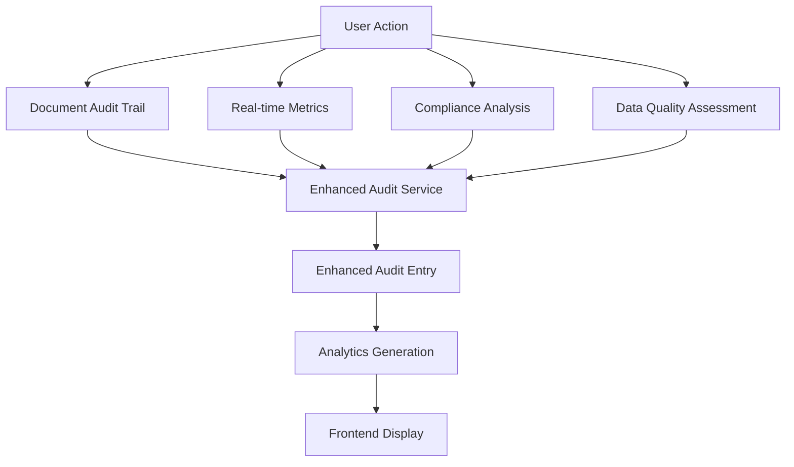
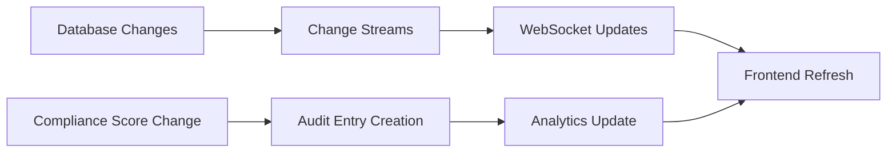

# Enhanced Audit Trail Implementation Guide

## 🎯 Overview

The Enhanced Audit Trail system integrates multiple data sources to provide comprehensive audit tracking with compliance metrics, data quality information, real-time activity context, and workflow integration. This system transforms the basic document audit trail into a powerful compliance and monitoring tool.

## 🏗️ Architecture

### Data Sources Integration

The enhanced audit trail aggregates data from multiple sources:

1. **Document Audit Trail** - Base document actions and changes
2. **Compliance Metrics** - Standards compliance scores and trends
3. **Data Quality Metrics** - Quality assessments and issues
4. **Real-time Metrics** - User activity and session context
5. **Compliance Workflows** - Workflow status and assignments
6. **Alerts & Notifications** - Alert context and resolution status
7. **User Sessions** - Session tracking and user behavior

### Key Components

```
┌─────────────────────────────────────────────────────────────┐
│                    Enhanced Audit Trail                     │
├─────────────────────────────────────────────────────────────┤
│  Frontend Components                                        │
│  ├── EnhancedAuditTrail.tsx (Main Component)               │
│  ├── Analytics Dashboard                                   │
│  ├── Compliance View                                       │
│  └── User Activity View                                    │
├─────────────────────────────────────────────────────────────┤
│  Backend Services                                           │
│  ├── EnhancedAuditTrailService.ts                          │
│  ├── ComplianceDataService.ts                              │
│  ├── DataQualityService.ts                                 │
│  └── RealTimeDataService.ts                                │
├─────────────────────────────────────────────────────────────┤
│  API Routes                                                 │
│  ├── /api/v1/audit-trail/enhanced                          │
│  ├── /api/v1/audit-trail/enhanced/analytics                │
│  ├── /api/v1/audit-trail/enhanced/compliance/:projectId    │
│  ├── /api/v1/audit-trail/enhanced/user/:userId             │
│  └── /api/v1/audit-trail/enhanced/export                   │
├─────────────────────────────────────────────────────────────┤
│  Data Models                                                │
│  ├── DocumentAuditTrail.model.ts                           │
│  ├── ComplianceMetrics.model.ts                            │
│  ├── ComplianceIssue.model.ts                              │
│  ├── RealTimeMetrics.model.ts                              │
│  ├── UserSession.model.ts                                  │
│  └── Alert.model.ts                                        │
└─────────────────────────────────────────────────────────────┘
```

## 🚀 Features

### 1. Enhanced Data Integration

**Compliance Context:**
- Real-time compliance scores for BABOK, PMBOK, DMBOK, ISO standards
- Trend analysis with change percentages and direction indicators
- Historical compliance data correlation

**Data Quality Context:**
- Overall quality scores and component breakdowns
- Completeness, accuracy, and consistency metrics
- Issue tracking and resolution status

**Real-time Activity Context:**
- User session information and activity patterns
- Component interaction tracking
- Performance metrics and response times

**Workflow Integration:**
- Workflow status and assignment tracking
- Due date monitoring and escalation alerts
- Related document and stakeholder context

### 2. Advanced Analytics

**Compliance Analytics:**
- Compliance score trends over time
- Standard-specific performance analysis
- Risk assessment and trend prediction

**Data Quality Analytics:**
- Quality score progression tracking
- Issue identification and resolution patterns
- Data completeness and accuracy trends

**User Activity Analytics:**
- User behavior patterns and engagement metrics
- Compliance score correlation with user actions
- Session analysis and productivity insights

**System Health Analytics:**
- Performance metrics and response times
- Error rates and system stability
- Active user monitoring and capacity planning

### 3. Enhanced Filtering & Search

**Multi-dimensional Filtering:**
- By compliance standard (BABOK, PMBOK, DMBOK, ISO)
- By data quality metrics and issue severity
- By user activity and session context
- By workflow status and assignment

**Advanced Search:**
- Full-text search across all audit data
- Contextual search with compliance and quality filters
- Time-range filtering with trend analysis

### 4. Export & Reporting

**Multiple Export Formats:**
- JSON for data analysis and integration
- CSV for spreadsheet analysis
- Excel for comprehensive reporting

**Customizable Reports:**
- Compliance-focused reports
- Quality assessment reports
- User activity reports
- System performance reports

## 📊 Data Flow

### 1. Data Collection



### 2. Real-time Updates



## 🔧 Implementation Details

### Backend Service Integration

The `EnhancedAuditTrailService` integrates with multiple services:

```typescript
// Compliance context integration
const complianceData = await this.getComplianceContext(projectId, timestamp);

// Data quality context integration  
const qualityData = await this.getDataQualityContext(projectId, timestamp);

// Real-time context integration
const realTimeData = await this.getRealTimeContext(userId, sessionId, timestamp);

// Workflow context integration
const workflowData = await this.getWorkflowContext(projectId, documentId, timestamp);
```

### Frontend Component Architecture

The enhanced audit trail component provides multiple views:

1. **Entries View** - Detailed audit trail entries with expandable context
2. **Analytics View** - Comprehensive analytics dashboard
3. **Compliance View** - Compliance-focused audit events
4. **Users View** - User activity and behavior analysis

### API Endpoints

#### Enhanced Audit Trail
```
GET /api/v1/audit-trail/enhanced
- Comprehensive audit trail with integrated data
- Advanced filtering and pagination
- Real-time analytics integration
```

#### Analytics Dashboard
```
GET /api/v1/audit-trail/enhanced/analytics
- Compliance score trends
- Data quality metrics
- User activity summary
- System health indicators
```

#### Compliance Focus
```
GET /api/v1/audit-trail/enhanced/compliance/:projectId
- Compliance-specific audit events
- Standards performance tracking
- Quality trend analysis
```

#### User Activity
```
GET /api/v1/audit-trail/enhanced/user/:userId
- User-specific audit trail
- Activity pattern analysis
- Compliance score correlation
```

#### Data Export
```
GET /api/v1/audit-trail/enhanced/export?format=json|csv|xlsx
- Multi-format data export
- Customizable date ranges
- Project-specific filtering
```

## 🎨 User Interface Features

### Enhanced Entry Display

Each audit entry now includes:

- **Compliance Metrics** - Real-time compliance scores and trends
- **Data Quality Information** - Quality scores and issue counts
- **Session Context** - User session and activity details
- **Workflow Status** - Related workflow information
- **Alert Context** - Associated alerts and notifications
- **Technical Details** - IP, session, and system information

### Analytics Dashboard

- **Overview Cards** - Key metrics at a glance
- **Compliance Trends** - Visual trend analysis
- **Data Quality Charts** - Quality progression tracking
- **User Activity Summary** - Top users and activities
- **System Health** - Performance and stability metrics

### Interactive Features

- **Expandable Entries** - Detailed context on demand
- **Advanced Filtering** - Multi-dimensional filtering
- **Real-time Updates** - Live data refresh
- **Export Functionality** - Multiple export formats
- **Search Capabilities** - Full-text search across all data

## 🔍 Compliance Integration

### Standards Compliance Tracking

The enhanced audit trail automatically tracks:

1. **BABOK Compliance** - Business analysis best practices
2. **PMBOK Compliance** - Project management standards
3. **DMBOK Compliance** - Data management best practices
4. **ISO Compliance** - International standards adherence

### Quality Metrics Integration

- **Completeness Scores** - Data completeness tracking
- **Accuracy Metrics** - Data accuracy assessment
- **Consistency Checks** - Data consistency validation
- **Timeliness Monitoring** - Data freshness tracking

### Issue Resolution Tracking

- **Issue Identification** - Automatic issue detection
- **Resolution Status** - Issue resolution tracking
- **Escalation Management** - Critical issue escalation
- **Performance Correlation** - Issue impact on compliance

## 📈 Benefits

### For Compliance Teams

- **Comprehensive Tracking** - Complete audit trail with context
- **Trend Analysis** - Historical compliance and quality trends
- **Risk Assessment** - Early identification of compliance risks
- **Reporting** - Detailed compliance reports for stakeholders

### For Project Managers

- **Project Visibility** - Complete project audit history
- **Quality Monitoring** - Real-time quality metrics
- **User Activity** - Team productivity and engagement insights
- **Issue Tracking** - Proactive issue identification and resolution

### For System Administrators

- **System Health** - Performance and stability monitoring
- **User Behavior** - Usage patterns and system optimization
- **Data Quality** - System-wide data quality assessment
- **Compliance Monitoring** - Automated compliance tracking

## 🚀 Future Enhancements

### Planned Features

1. **Predictive Analytics** - AI-powered compliance prediction
2. **Automated Alerts** - Smart alerting based on patterns
3. **Integration APIs** - Third-party system integration
4. **Mobile Support** - Mobile-optimized audit trail access
5. **Advanced Visualization** - Interactive charts and dashboards

### Scalability Considerations

- **Database Optimization** - Indexing and query optimization
- **Caching Strategy** - Redis caching for frequently accessed data
- **Microservices Architecture** - Service decomposition for scalability
- **Real-time Processing** - Stream processing for high-volume events

## 🔧 Configuration

### Environment Variables

```bash
# MongoDB connection
MONGODB_URI=mongodb://localhost:27017/requirements-gathering-agent

# WebSocket configuration
WEBSOCKET_PORT=3002

# Analytics configuration
ANALYTICS_CACHE_TTL=300
ANALYTICS_BATCH_SIZE=1000

# Export configuration
EXPORT_MAX_RECORDS=10000
EXPORT_TIMEOUT=300000
```

### Database Indexes

```javascript
// Performance optimization indexes
db.documentaudittrails.createIndex({ "projectId": 1, "timestamp": -1 });
db.documentaudittrails.createIndex({ "userId": 1, "timestamp": -1 });
db.documentaudittrails.createIndex({ "category": 1, "severity": 1 });
db.documentaudittrails.createIndex({ "action": 1, "timestamp": -1 });
```

## 📝 Usage Examples

### Creating Enhanced Audit Entries

```typescript
// Create compliance-focused audit entry
const auditEntry = await enhancedAuditTrailService.createEnhancedAuditEntry({
  documentId: 'doc-123',
  documentName: 'Requirements Specification',
  documentType: 'requirements',
  projectId: 'project-456',
  projectName: 'Customer Portal',
  action: 'quality_assessed',
  actionDescription: 'Document quality assessed with compliance scoring',
  category: 'quality',
  severity: 'medium',
  userId: 'user-789',
  userName: 'John Doe',
  userRole: 'Business Analyst',
  contextData: {
    aiProvider: 'OpenAI',
    aiModel: 'GPT-4',
    qualityScore: 87,
    templateUsed: 'BABOK Requirements Template'
  },
  notes: 'Compliance score improved from 82% to 87%',
  tags: ['compliance', 'quality', 'babok']
});
```

### Querying Enhanced Audit Trail

```typescript
// Get compliance-focused audit trail
const result = await enhancedAuditTrailService.getEnhancedAuditTrail({
  projectId: 'project-456',
  includeCompliance: true,
  includeQuality: true,
  startDate: new Date('2024-01-01'),
  endDate: new Date('2024-12-31')
}, 1, 50);
```

### Exporting Audit Data

```typescript
// Export compliance data as CSV
const response = await fetch('/api/v1/audit-trail/enhanced/export?format=csv&projectId=project-456');
const csvData = await response.text();
```

## 🎯 Success Metrics

### Key Performance Indicators

1. **Compliance Score Trends** - Improvement in compliance scores over time
2. **Data Quality Metrics** - Reduction in data quality issues
3. **User Engagement** - Increased user activity and system usage
4. **Issue Resolution Time** - Faster identification and resolution of issues
5. **System Performance** - Improved response times and stability

### Monitoring & Alerting

- **Compliance Thresholds** - Automated alerts for compliance score drops
- **Quality Degradation** - Alerts for data quality issues
- **Performance Monitoring** - System performance tracking
- **User Activity Patterns** - Unusual activity pattern detection

## 📚 Conclusion

The Enhanced Audit Trail system provides a comprehensive solution for compliance monitoring, quality tracking, and user activity analysis. By integrating multiple data sources and providing advanced analytics, it transforms basic audit logging into a powerful compliance and monitoring platform.

The system is designed for scalability, extensibility, and ease of use, making it suitable for organizations of all sizes that need comprehensive audit trail capabilities with compliance focus.

---

*For technical support or feature requests, please contact the development team or create an issue in the project repository.*
