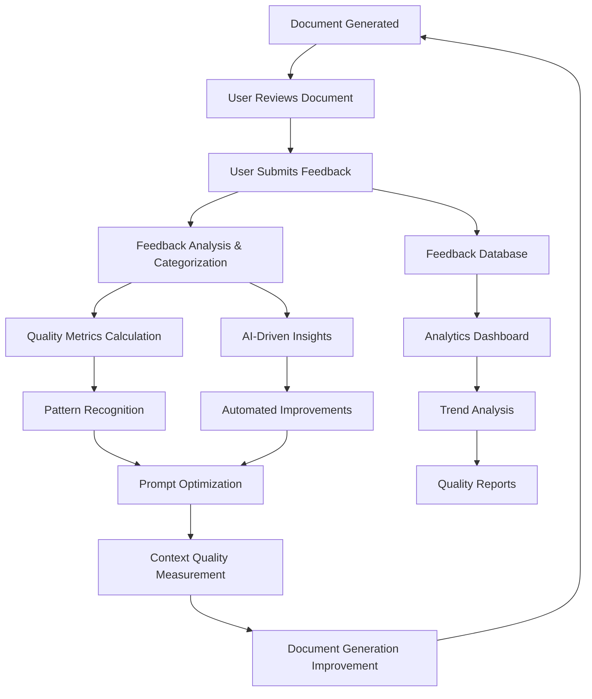
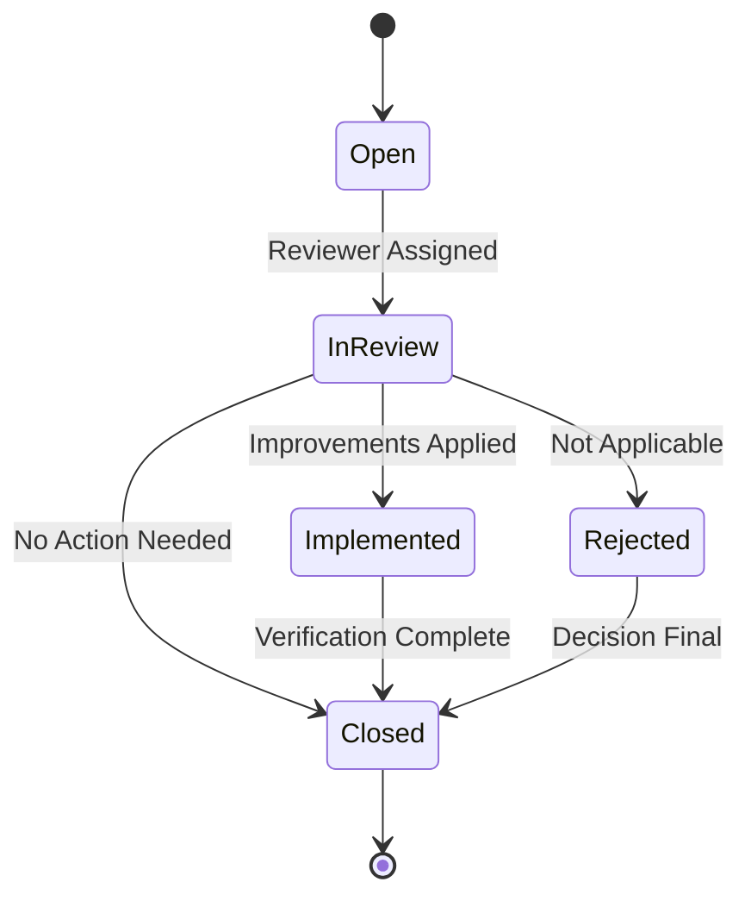

# Document Generation Feedback Loop System

## Overview

The Document Generation Feedback Loop System is a comprehensive mechanism that enables users to provide structured feedback on AI-generated documents, which then drives continuous improvement in document quality through automated learning and prompt optimization.

## 🔄 **Complete Feedback Loop Architecture**



## 📋 **Feedback Types & Rating System**

### **6 Core Feedback Types**

#### 1. **Quality** ⭐
- **Description**: Overall document quality and professionalism
- **Focus Areas**:
  - Professional presentation
  - Language quality
  - Formatting consistency
  - Visual appeal
  - User experience

#### 2. **Accuracy** 🎯
- **Description**: Factual correctness and precision
- **Focus Areas**:
  - Technical accuracy
  - Data correctness
  - Fact verification
  - Consistency with project context
  - Error identification

#### 3. **Completeness** ✅
- **Description**: Missing information or sections
- **Focus Areas**:
  - Required sections present
  - Information depth
  - Coverage of all aspects
  - Missing details identification
  - Scope completeness

#### 4. **Clarity** 📝
- **Description**: Readability and understanding
- **Focus Areas**:
  - Language clarity
  - Structure organization
  - Explanation quality
  - Jargon appropriateness
  - Comprehension ease

#### 5. **Compliance** ⚠️
- **Description**: Standards and framework adherence
- **Focus Areas**:
  - PMBOK compliance
  - BABOK standards
  - DMBOK adherence
  - Industry standards
  - Regulatory compliance

#### 6. **Suggestion** 💡
- **Description**: Ideas for improvement
- **Focus Areas**:
  - Enhancement recommendations
  - Process improvements
  - Feature additions
  - Workflow optimizations
  - Innovation ideas

### **Rating Scale: 1-5 Stars**

| Rating | Description | Quality Level | Action Required |
|--------|-------------|---------------|-----------------|
| ⭐ (1) | Poor | Critical Issues | Immediate Action |
| ⭐⭐ (2) | Below Average | Major Issues | High Priority |
| ⭐⭐⭐ (3) | Average | Some Issues | Medium Priority |
| ⭐⭐⭐⭐ (4) | Good | Minor Issues | Low Priority |
| ⭐⭐⭐⭐⭐ (5) | Excellent | No Issues | No Action |

## 📊 **Feedback Structure**

### **Required Fields**

```typescript
interface DocumentFeedback {
  // Document Identification
  projectId: string;                    // Project the document belongs to
  documentType: string;                 // Type of document (e.g., "project-charter")
  documentPath: string;                 // File path to the document
  
  // Feedback Classification
  feedbackType: 'quality' | 'accuracy' | 'completeness' | 'clarity' | 'compliance' | 'suggestion';
  rating: number;                       // 1-5 scale
  
  // Feedback Content
  title: string;                        // Brief summary of feedback (max 200 chars)
  description: string;                  // Detailed description (max 2000 chars)
  suggestedImprovement?: string;        // Specific improvement suggestions
  
  // Prioritization & Organization
  priority: 'low' | 'medium' | 'high' | 'critical';
  tags: string[];                       // Categorization tags
  category: string;                     // PMBOK/BABOK category
  
  // User Information
  submittedBy: string;                  // User ID
  submittedByName: string;              // User display name
  submittedAt: Date;                    // Submission timestamp
}
```

### **Feedback Status Workflow**



## 🔍 **Detailed Feedback Components**

### **1. Title (Brief Summary)**
- **Purpose**: Quick identification of the feedback issue
- **Format**: Concise, descriptive summary
- **Examples**:
  - "Missing stakeholder analysis section"
  - "Technical requirements unclear"
  - "Budget section needs more detail"
  - "Timeline conflicts with dependencies"

### **2. Description**
- **Purpose**: Detailed explanation of the issue
- **Content**: 
  - What is wrong or missing
  - Why it's important
  - Context and background
  - Specific examples or references

### **3. Suggested Improvement**
- **Purpose**: Actionable recommendations
- **Content**:
  - Specific steps to fix the issue
  - Alternative approaches
  - Best practices to follow
  - Reference materials or examples

### **4. Priority Levels**

#### **Critical** 🔴
- **Impact**: Blocks document approval or project progress
- **Examples**:
  - Missing critical project information
  - Compliance violations
  - Major technical errors
  - Security vulnerabilities

#### **High** 🟠
- **Impact**: Significantly affects document quality
- **Examples**:
  - Important sections missing
  - Major clarity issues
  - Inaccurate information
  - Poor formatting affecting usability

#### **Medium** 🟡
- **Impact**: Moderate quality improvement needed
- **Examples**:
  - Minor sections missing
  - Some clarity improvements needed
  - Formatting inconsistencies
  - Minor accuracy issues

#### **Low** 🟢
- **Impact**: Nice-to-have improvements
- **Examples**:
  - Cosmetic improvements
  - Additional examples
  - Minor clarifications
  - Enhancement suggestions

### **5. Tags & Categories**

#### **Common Tags**
- `missing-section`
- `unclear-language`
- `formatting-issue`
- `technical-error`
- `compliance-gap`
- `enhancement`
- `critical-path`
- `stakeholder-related`

#### **Category Examples**
- **PMBOK Categories**: Scope Management, Time Management, Cost Management
- **BABOK Categories**: Requirements Analysis, Solution Evaluation
- **DMBOK Categories**: Data Quality, Data Governance
- **Technical Categories**: Architecture, Security, Performance

## 🔄 **Feedback Processing & Integration**

### **1. Immediate Processing**
```typescript
// When feedback is submitted
async function processFeedback(feedback: DocumentFeedback) {
  // 1. Validate feedback data
  await validateFeedback(feedback);
  
  // 2. Calculate quality impact
  const qualityImpact = await calculateQualityImpact(feedback);
  
  // 3. Update document metrics
  await updateDocumentMetrics(feedback.documentType, qualityImpact);
  
  // 4. Trigger automated improvements if applicable
  if (feedback.priority === 'critical' || feedback.rating <= 2) {
    await triggerAutomatedImprovements(feedback);
  }
  
  // 5. Notify relevant stakeholders
  await notifyStakeholders(feedback);
}
```

### **2. Pattern Recognition**
```typescript
// Analyze feedback patterns
async function analyzeFeedbackPatterns() {
  // Group feedback by document type and issue
  const patterns = await groupFeedbackByPatterns();
  
  // Identify common issues
  const commonIssues = await identifyCommonIssues(patterns);
  
  // Calculate improvement priorities
  const priorities = await calculateImprovementPriorities(commonIssues);
  
  // Generate improvement recommendations
  const recommendations = await generateRecommendations(priorities);
  
  return {
    patterns,
    commonIssues,
    priorities,
    recommendations
  };
}
```

### **3. Automated Improvements**
```typescript
// Apply automated improvements based on feedback
async function applyAutomatedImprovements(feedback: DocumentFeedback) {
  switch (feedback.feedbackType) {
    case 'completeness':
      // Add missing sections to templates
      await updateDocumentTemplates(feedback);
      break;
      
    case 'clarity':
      // Improve prompt clarity instructions
      await updatePromptInstructions(feedback);
      break;
      
    case 'accuracy':
      // Update context validation rules
      await updateValidationRules(feedback);
      break;
      
    case 'compliance':
      // Enhance compliance checking
      await updateComplianceChecks(feedback);
      break;
  }
}
```

## 📈 **Integration with Context Quality Measurement**

### **Feedback-Driven Quality Assessment**

The feedback system integrates seamlessly with the Context Quality Measurement Framework:

```typescript
// Enhanced quality assessment using feedback
async function assessQualityWithFeedback(document: string, feedback: DocumentFeedback[]) {
  // 1. Run automated quality metrics
  const automatedScores = await qualityScorer.analyzeDocumentQuality(document, metadata);
  
  // 2. Incorporate feedback insights
  const feedbackInsights = await analyzeFeedbackInsights(feedback);
  
  // 3. Adjust scores based on user feedback
  const adjustedScores = await adjustScoresWithFeedback(automatedScores, feedbackInsights);
  
  // 4. Calculate improvement recommendations
  const recommendations = await generateImprovementRecommendations(adjustedScores, feedback);
  
  return {
    automatedScores,
    feedbackInsights,
    adjustedScores,
    recommendations,
    improvementPriority: calculateImprovementPriority(feedback)
  };
}
```

### **Context Window Optimization Based on Feedback**

```typescript
// Optimize context window usage based on feedback patterns
async function optimizeContextBasedOnFeedback(feedback: DocumentFeedback[]) {
  // Analyze feedback related to context issues
  const contextRelatedFeedback = feedback.filter(f => 
    f.feedbackType === 'completeness' || 
    f.feedbackType === 'accuracy'
  );
  
  if (contextRelatedFeedback.length > 0) {
    // Run A/B test with larger context window
    const abTestResult = await contextABTesting.runQuickComparison(
      projectPath,
      documentType,
      ['limited_8k', 'full_1m']
    );
    
    // If improvement is significant, recommend larger context
    if (abTestResult.improvementMetrics.overallImprovement > 15) {
      await updateContextStrategy(documentType, 'full_library');
    }
  }
}
```

## 📊 **Analytics & Reporting**

### **Feedback Analytics Dashboard**

```typescript
interface FeedbackAnalytics {
  // Overall Metrics
  totalFeedback: number;
  averageRating: number;
  improvementTrend: number;
  
  // Feedback Type Breakdown
  feedbackByType: {
    quality: number;
    accuracy: number;
    completeness: number;
    clarity: number;
    compliance: number;
    suggestion: number;
  };
  
  // Priority Distribution
  priorityDistribution: {
    critical: number;
    high: number;
    medium: number;
    low: number;
  };
  
  // Document Performance
  documentPerformance: Array<{
    documentType: string;
    averageRating: number;
    totalFeedback: number;
    improvementRate: number;
  }>;
  
  // Trend Analysis
  trends: {
    monthlyImprovement: number[];
    commonIssues: string[];
    topImprovements: string[];
  };
}
```

### **Quality Improvement Reports**

```typescript
// Generate comprehensive quality improvement reports
async function generateQualityReport(projectId: string) {
  const feedback = await getProjectFeedback(projectId);
  const analytics = await analyzeFeedback(feedback);
  const improvements = await trackImprovements(feedback);
  
  return {
    executiveSummary: {
      overallQuality: analytics.averageRating,
      improvementRate: improvements.improvementRate,
      criticalIssues: analytics.priorityDistribution.critical,
      recommendations: generateTopRecommendations(analytics)
    },
    
    detailedAnalysis: {
      feedbackBreakdown: analytics.feedbackByType,
      documentPerformance: analytics.documentPerformance,
      trendAnalysis: analytics.trends,
      improvementTracking: improvements
    },
    
    actionPlan: {
      immediateActions: generateImmediateActions(analytics),
      longTermGoals: generateLongTermGoals(analytics),
      resourceRequirements: calculateResourceNeeds(analytics)
    }
  };
}
```

## 🎯 **Best Practices for Feedback Submission**

### **For Users Submitting Feedback**

#### **1. Be Specific**
- ❌ "This document is unclear"
- ✅ "The risk assessment section lacks specific mitigation strategies for technical risks"

#### **2. Provide Context**
- ❌ "Missing information"
- ✅ "The project timeline section is missing dependency relationships between tasks A and B"

#### **3. Suggest Improvements**
- ❌ "Fix this section"
- ✅ "Add a dependency matrix table showing task relationships and critical path analysis"

#### **4. Use Appropriate Priority**
- **Critical**: Blocks project progress
- **High**: Significantly impacts quality
- **Medium**: Moderate improvement needed
- **Low**: Nice-to-have enhancement

#### **5. Add Relevant Tags**
- Use existing tags when possible
- Create new tags for recurring issues
- Group related feedback with similar tags

### **For System Administrators**

#### **1. Monitor Feedback Patterns**
- Track common issues across documents
- Identify recurring problems
- Monitor improvement trends

#### **2. Prioritize Improvements**
- Focus on critical and high-priority feedback first
- Address issues affecting multiple documents
- Implement systemic improvements

#### **3. Measure Impact**
- Track quality improvements over time
- Measure user satisfaction
- Monitor document approval rates

## 🔧 **Implementation Examples**

### **1. Submitting Feedback via API**

```typescript
// Submit feedback for a document
const feedback = {
  projectId: "proj_123",
  documentType: "project-charter",
  documentPath: "/documents/project-charter.md",
  feedbackType: "completeness",
  rating: 2,
  title: "Missing stakeholder analysis section",
  description: "The project charter lacks a comprehensive stakeholder analysis section. This is critical for project success as it identifies all parties with interest in the project outcome.",
  suggestedImprovement: "Add a stakeholder analysis section including: stakeholder identification, influence/interest matrix, communication requirements, and engagement strategies.",
  priority: "high",
  tags: ["missing-section", "stakeholder-related", "critical-path"],
  category: "PMBOK-Stakeholder Management",
  submittedBy: "user_456",
  submittedByName: "John Smith"
};

await feedbackController.submitFeedback(feedback);
```

### **2. Processing Feedback for Improvements**

```typescript
// Process feedback to improve document generation
async function processFeedbackForImprovement(feedback: DocumentFeedback) {
  // 1. Analyze the feedback
  const analysis = await analyzeFeedback(feedback);
  
  // 2. Determine improvement actions
  const actions = await determineImprovementActions(analysis);
  
  // 3. Apply automated improvements
  if (actions.automated) {
    await applyAutomatedImprovements(actions);
  }
  
  // 4. Update quality metrics
  await updateQualityMetrics(feedback.documentType, analysis.impact);
  
  // 5. Trigger context optimization if needed
  if (analysis.contextRelated) {
    await optimizeContextForDocumentType(feedback.documentType);
  }
}
```

### **3. Integration with Context Quality Measurement**

```typescript
// Use feedback to optimize context window usage
async function optimizeContextWithFeedback(documentType: string) {
  // Get feedback for this document type
  const feedback = await getFeedbackByDocumentType(documentType);
  
  // Analyze feedback patterns
  const patterns = await analyzeFeedbackPatterns(feedback);
  
  // If completeness/accuracy issues are common, try larger context
  if (patterns.commonIssues.includes('completeness') || 
      patterns.commonIssues.includes('accuracy')) {
    
    // Run A/B test comparing context sizes
    const abTestResult = await contextABTesting.runQuickComparison(
      projectPath,
      documentType,
      ['limited_8k', 'full_1m']
    );
    
    // If improvement is significant, update strategy
    if (abTestResult.improvementMetrics.overallImprovement > 15) {
      await updateContextStrategy(documentType, 'full_library');
      console.log(`✅ Updated ${documentType} to use full project library context`);
    }
  }
}
```

## 📋 **Feedback Loop Benefits**

### **For Users**
- **Quality Assurance**: Ensure documents meet standards
- **Continuous Improvement**: Drive better document generation
- **Voice in Process**: Influence system improvements
- **Learning Opportunity**: Understand document requirements better

### **For System**
- **Automated Learning**: Improve without manual intervention
- **Quality Metrics**: Measure and track improvements
- **Pattern Recognition**: Identify systemic issues
- **Context Optimization**: Better utilize large context windows

### **For Organizations**
- **Higher Quality Documents**: Better project outcomes
- **Reduced Rework**: Fewer document revisions needed
- **Compliance Assurance**: Better adherence to standards
- **Knowledge Capture**: Preserve improvement insights

## 🚀 **Future Enhancements**

### **Planned Features**
1. **AI-Powered Feedback Analysis**: Automatic categorization and insight generation
2. **Predictive Quality Assessment**: Predict document quality before generation
3. **Automated Improvement Implementation**: Self-healing document generation
4. **Advanced Analytics**: Machine learning-based pattern recognition
5. **Integration with External Tools**: Connect with project management systems

### **Advanced Capabilities**
- **Real-time Feedback Processing**: Immediate improvement application
- **Cross-Project Learning**: Apply insights across multiple projects
- **Personalized Quality Standards**: Customize quality criteria per user/project
- **Automated Compliance Checking**: Real-time standards validation

---

This feedback loop system creates a powerful cycle of continuous improvement, where user feedback drives system enhancements, leading to better document quality and more effective utilization of large context windows. The integration with the Context Quality Measurement Framework ensures that improvements are measurable and data-driven, providing clear ROI for investment in larger context windows.
