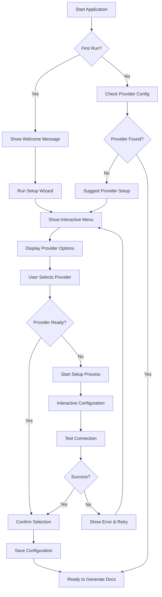
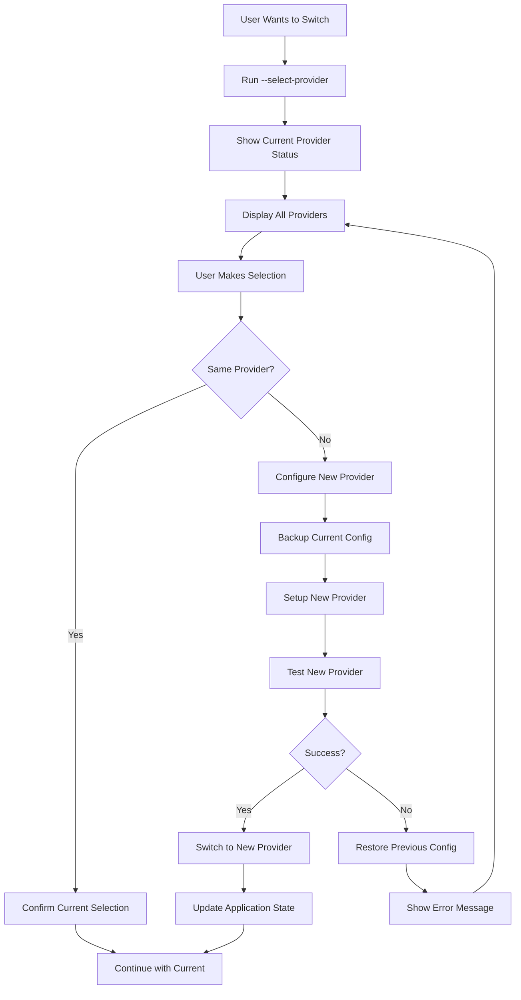
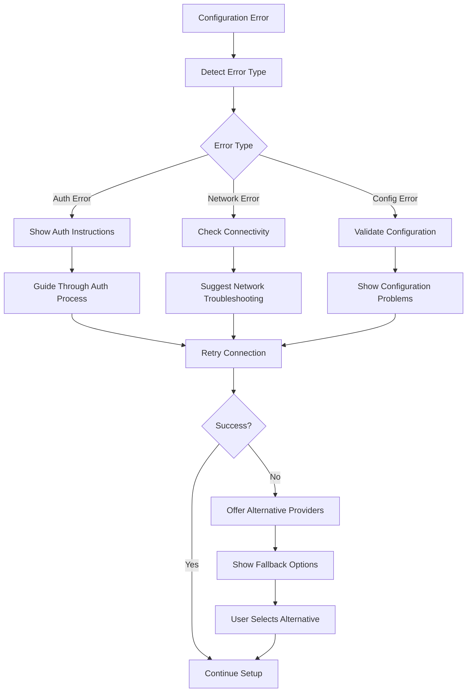

# Interactive AI Provider Selection Menu - Implementation Guide

**Document Version:** 1.0  
**Created:** December 2024  
**Last Updated:** December 2024  
**Target Audience:** Developers, Technical Leads, Product Managers  

---

## 📋 Table of Contents

1. [Overview](#overview)
2. [Current System Analysis](#current-system-analysis)
3. [Implementation Strategy](#implementation-strategy)
4. [Interactive Choice Menu Design](#interactive-choice-menu-design)
5. [Code Implementation](#code-implementation)
6. [Integration with Existing System](#integration-with-existing-system)
7. [User Experience Flow](#user-experience-flow)
8. [Error Handling & Validation](#error-handling--validation)
9. [Testing Strategy](#testing-strategy)
10. [Migration Guide](#migration-guide)
11. [Best Practices](#best-practices)
12. [Troubleshooting](#troubleshooting)

---

## 📖 Overview

This guide provides comprehensive documentation for implementing an interactive choice menu that allows users to select an AI provider before running the Requirements Gathering Agent. The feature enhances user experience by providing a visual selection interface instead of requiring manual environment configuration.

### 🎯 Objectives

- **Simplify Provider Selection**: Replace manual `.env` configuration with an interactive menu
- **Improve User Experience**: Provide clear provider options with descriptions and setup guidance
- **Maintain Existing Functionality**: Preserve current provider detection and fallback mechanisms
- **Enable Dynamic Switching**: Allow users to change providers without restarting the application

### 🔧 Key Features

- Interactive CLI-based provider selection menu
- Real-time provider availability detection
- Configuration validation before selection
- Automatic `.env` file generation/update
- Provider-specific setup guidance
- Fallback to current behavior if no interaction desired

---

## 🔍 Current System Analysis

### Existing Provider Management Architecture

The Requirements Gathering Agent currently supports multiple AI providers through a robust architecture:

#### 1. **Provider Detection System** (`cli.ts`)

```typescript
function detectConfiguredProviders(): string[] {
  const providerConfigs = [
    { 
      name: 'Google AI Studio', 
      check: (): boolean => !!process.env.GOOGLE_AI_API_KEY 
    },
    { 
      name: 'Azure OpenAI (Entra ID)', 
      check: (): boolean => !!process.env.AZURE_OPENAI_ENDPOINT && process.env.USE_ENTRA_ID === 'true' 
    },
    { 
      name: 'Azure OpenAI (API Key)', 
      check: (): boolean => !!(process.env.AZURE_AI_ENDPOINT?.includes('openai.azure.com') && process.env.AZURE_AI_API_KEY)
    },
    { 
      name: 'GitHub AI', 
      check: (): boolean => !!(process.env.GITHUB_TOKEN && (
        process.env.AZURE_AI_ENDPOINT?.includes('models.inference.ai.azure.com') || 
        process.env.AZURE_AI_ENDPOINT?.includes('models.github.ai')
      ))
    },
    { 
      name: 'Ollama (Local)', 
      check: (): boolean => !!(
        process.env.AZURE_AI_ENDPOINT?.includes('localhost:11434') || 
        process.env.AZURE_AI_ENDPOINT?.includes('127.0.0.1:11434')
      )
    }
  ];

  return providerConfigs
    .filter(config => config.check())
    .map(config => config.name);
}
```

#### 2. **Provider Management** (`ProviderManager.ts`)

The system includes sophisticated provider management with:
- Provider configuration validation
- Metrics tracking (`ProviderMetrics`)
- Failover mechanisms
- Rate limiting
- Quota management

#### 3. **Configuration Management** (`ConfigurationManager.ts`)

Handles environment variable management and configuration validation.

#### 4. **Current Setup Wizard** (`runSetupWizard()`)

Provides step-by-step configuration guidance but requires manual `.env` editing.

---

## 🎯 Implementation Strategy

### Phase 1: Core Interactive Menu System

1. **Create Interactive Selection Interface**
   - CLI-based menu using inquirer.js or native Node.js readline
   - Provider list display with status indicators
   - Configuration validation integration

2. **Extend Provider Configuration**
   - Enhanced provider metadata (descriptions, requirements, setup guides)
   - Provider availability checking
   - Configuration template generation

3. **Integrate with Existing Architecture**
   - Preserve current provider detection logic
   - Extend setup wizard functionality
   - Maintain backward compatibility

### Phase 2: Enhanced User Experience

1. **Provider Status Indicators**
   - Real-time availability checking
   - Configuration completeness indicators
   - Performance/recommendation scoring

2. **Guided Configuration**
   - Provider-specific setup assistance
   - Interactive credential input
   - Validation feedback

3. **Advanced Features**
   - Provider switching without restart
   - Multiple provider configuration
   - Provider performance comparison

---

## 🎨 Interactive Choice Menu Design

### Menu Structure

```
🤖 AI Provider Selection Menu

Choose your AI provider for Requirements Gathering Agent:

  1. ✅ Google AI Studio (Free Tier) - CONFIGURED
     └─ Large context support (1M-2M tokens)
     └─ Easy setup with API key

  2. ⚠️  Azure OpenAI (Enterprise) - NEEDS SETUP
     └─ Enterprise-grade reliability
     └─ Entra ID authentication available

  3. ✅ GitHub AI (Free for GitHub users) - CONFIGURED
     └─ Free tier available
     └─ gpt-4o-mini model access

  4. ❌ Ollama (Local AI) - NOT AVAILABLE
     └─ Offline/local processing
     └─ Requires Ollama installation

  5. 🔧 Configure New Provider
  6. 📊 View Provider Status & Metrics
  7. ❓ Help & Documentation
  8. 🚫 Exit Menu

Enter your choice (1-8): _
```

### Status Indicators

- ✅ **CONFIGURED & READY**: Provider fully set up and tested
- ⚠️ **NEEDS SETUP**: Provider available but requires configuration
- ❌ **NOT AVAILABLE**: Provider not accessible (service down, not installed)
- 🔄 **CHECKING**: Validating provider status
- 🚧 **PARTIAL**: Partially configured, missing some requirements

### Interactive Elements

1. **Navigation**: Number-based selection or arrow keys
2. **Real-time Status**: Dynamic provider availability checking
3. **Contextual Help**: Provider-specific guidance and links
4. **Quick Actions**: Test connection, view logs, reset configuration

---

## 💻 Code Implementation

### 1. Enhanced Provider Configuration Interface

```typescript
// types.ts - Extended Provider Configuration
export interface EnhancedProviderConfig {
  id: string;
  name: string;
  displayName: string;
  description: string;
  category: 'cloud' | 'local' | 'free' | 'enterprise';
  priority: number;
  
  // Status and availability
  check: () => Promise<boolean>;
  isAvailable: () => Promise<boolean>;
  getStatus: () => Promise<ProviderStatus>;
  
  // Configuration
  requiredEnvVars: string[];
  optionalEnvVars: string[];
  configTemplate: Record<string, string>;
  setupGuide: SetupGuide;
  
  // Capabilities
  tokenLimit: number;
  features: string[];
  costInfo?: CostInfo;
  
  // UI
  icon: string;
  statusColor: string;
  recommendation?: string;
}

export interface ProviderStatus {
  configured: boolean;
  available: boolean;
  connected: boolean;
  lastChecked: Date;
  error?: string;
  metrics?: ProviderMetrics;
}

export interface SetupGuide {
  steps: SetupStep[];
  estimatedTime: string;
  difficulty: 'easy' | 'medium' | 'advanced';
  prerequisites: string[];
  helpLinks: { title: string; url: string }[];
}
```

### 2. Interactive Menu Implementation

```typescript
// interactive-provider-menu.ts
import { createInterface } from 'readline';
import { promisify } from 'util';

export class InteractiveProviderMenu {
  private readline: any;
  private providers: Map<string, EnhancedProviderConfig> = new Map();
  private currentSelection: string | null = null;

  constructor() {
    this.readline = createInterface({
      input: process.stdin,
      output: process.stdout
    });
    this.initializeProviders();
  }

  /**
   * Main menu display and interaction loop
   */
  async showMenu(): Promise<string | null> {
    while (true) {
      await this.clearScreen();
      await this.displayHeader();
      await this.displayProviders();
      await this.displayMenuOptions();
      
      const choice = await this.getUserInput('Enter your choice: ');
      const result = await this.handleMenuChoice(choice);
      
      if (result) {
        return result; // Provider selected
      }
    }
  }

  /**
   * Display formatted provider list with status indicators
   */
  private async displayProviders(): Promise<void> {
    console.log('\n🤖 Available AI Providers:\n');
    
    const sortedProviders = Array.from(this.providers.values())
      .sort((a, b) => a.priority - b.priority);

    for (let i = 0; i < sortedProviders.length; i++) {
      const provider = sortedProviders[i];
      const status = await provider.getStatus();
      const statusIcon = this.getStatusIcon(status);
      const statusText = this.getStatusText(status);
      
      console.log(`  ${i + 1}. ${statusIcon} ${provider.displayName} - ${statusText}`);
      console.log(`     └─ ${provider.description}`);
      
      if (provider.recommendation) {
        console.log(`     └─ 💡 ${provider.recommendation}`);
      }
      
      if (!status.configured && status.available) {
        console.log(`     └─ 🔧 Setup time: ~${provider.setupGuide.estimatedTime}`);
      }
      
      console.log('');
    }
  }

  /**
   * Handle user menu selection
   */
  private async handleMenuChoice(choice: string): Promise<string | null> {
    const choiceNum = parseInt(choice);
    const providers = Array.from(this.providers.values())
      .sort((a, b) => a.priority - b.priority);

    // Handle provider selection (1-N)
    if (choiceNum >= 1 && choiceNum <= providers.length) {
      const selectedProvider = providers[choiceNum - 1];
      return await this.handleProviderSelection(selectedProvider);
    }

    // Handle menu options
    const menuOffset = providers.length;
    switch (choiceNum) {
      case menuOffset + 1: // Configure New Provider
        return await this.configureNewProvider();
      
      case menuOffset + 2: // View Status & Metrics
        await this.showProviderMetrics();
        break;
      
      case menuOffset + 3: // Help & Documentation
        await this.showHelp();
        break;
      
      case menuOffset + 4: // Exit
        return null;
      
      default:
        console.log('❌ Invalid choice. Please try again.');
        await this.pause();
    }

    return null; // Continue menu loop
  }

  /**
   * Handle selection of a specific provider
   */
  private async handleProviderSelection(provider: EnhancedProviderConfig): Promise<string | null> {
    const status = await provider.getStatus();

    if (status.configured && status.available) {
      // Provider ready - confirm selection
      console.log(`\n✅ ${provider.displayName} is ready!`);
      const confirm = await this.getUserInput('Use this provider? (y/n): ');
      
      if (confirm.toLowerCase() === 'y' || confirm.toLowerCase() === 'yes') {
        return provider.id;
      }
    } else if (status.available && !status.configured) {
      // Provider available but needs setup
      console.log(`\n🔧 ${provider.displayName} needs configuration.`);
      const setup = await this.getUserInput('Start setup now? (y/n): ');
      
      if (setup.toLowerCase() === 'y' || setup.toLowerCase() === 'yes') {
        const configured = await this.runProviderSetup(provider);
        if (configured) {
          return provider.id;
        }
      }
    } else {
      // Provider not available
      console.log(`\n❌ ${provider.displayName} is not available.`);
      if (status.error) {
        console.log(`   Error: ${status.error}`);
      }
      console.log('   Please check the setup requirements and try again.');
      await this.pause();
    }

    return null; // Continue menu
  }

  /**
   * Run interactive setup for a provider
   */
  private async runProviderSetup(provider: EnhancedProviderConfig): Promise<boolean> {
    console.log(`\n🚀 Setting up ${provider.displayName}\n`);
    
    // Display setup guide
    console.log(`📋 Setup Guide (${provider.setupGuide.difficulty} - ~${provider.setupGuide.estimatedTime})\n`);
    
    for (let i = 0; i < provider.setupGuide.steps.length; i++) {
      const step = provider.setupGuide.steps[i];
      console.log(`${i + 1}. ${step.title}`);
      if (step.description) {
        console.log(`   ${step.description}`);
      }
      console.log('');
    }

    // Interactive configuration
    const config: Record<string, string> = {};
    
    for (const envVar of provider.requiredEnvVars) {
      const template = provider.configTemplate[envVar];
      let prompt = `Enter ${envVar}`;
      
      if (template) {
        prompt += ` (${template})`;
      }
      prompt += ': ';
      
      const value = await this.getUserInput(prompt);
      if (!value.trim()) {
        console.log('❌ Required field cannot be empty.');
        return false;
      }
      
      config[envVar] = value.trim();
    }

    // Optional configuration
    for (const envVar of provider.optionalEnvVars) {
      const template = provider.configTemplate[envVar];
      let prompt = `Enter ${envVar} (optional)`;
      
      if (template) {
        prompt += ` (${template})`;
      }
      prompt += ': ';
      
      const value = await this.getUserInput(prompt);
      if (value.trim()) {
        config[envVar] = value.trim();
      }
    }

    // Validate and save configuration
    try {
      await this.saveProviderConfiguration(provider.id, config);
      
      // Test connection
      console.log('\n🔄 Testing connection...');
      const testResult = await this.testProviderConnection(provider.id);
      
      if (testResult.success) {
        console.log('✅ Connection successful!');
        return true;
      } else {
        console.log(`❌ Connection failed: ${testResult.error}`);
        return false;
      }
    } catch (error) {
      console.log(`❌ Configuration failed: ${error.message}`);
      return false;
    }
  }

  /**
   * Get status icon for provider status
   */
  private getStatusIcon(status: ProviderStatus): string {
    if (status.configured && status.available && status.connected) {
      return '✅';
    } else if (status.available && !status.configured) {
      return '⚠️';
    } else if (!status.available) {
      return '❌';
    } else {
      return '🔄';
    }
  }

  /**
   * Get status text for provider status
   */
  private getStatusText(status: ProviderStatus): string {
    if (status.configured && status.available && status.connected) {
      return 'READY';
    } else if (status.available && !status.configured) {
      return 'NEEDS SETUP';
    } else if (!status.available) {
      return 'NOT AVAILABLE';
    } else {
      return 'CHECKING';
    }
  }

  // Additional helper methods...
  private async getUserInput(prompt: string): Promise<string> {
    return new Promise((resolve) => {
      this.readline.question(prompt, (answer: string) => {
        resolve(answer);
      });
    });
  }

  private async clearScreen(): Promise<void> {
    console.clear();
  }

  private async pause(): Promise<void> {
    await this.getUserInput('\nPress Enter to continue...');
  }

  async cleanup(): Promise<void> {
    this.readline.close();
  }
}
```

### 3. Enhanced Provider Definitions

```typescript
// provider-definitions.ts
export const PROVIDER_DEFINITIONS: EnhancedProviderConfig[] = [
  {
    id: 'google-ai',
    name: 'Google AI Studio',
    displayName: 'Google AI Studio',
    description: 'Large context support (1M-2M tokens), free tier available',
    category: 'free',
    priority: 1,
    icon: '🟣',
    statusColor: 'purple',
    recommendation: 'Best for large projects with extensive documentation',
    
    requiredEnvVars: ['GOOGLE_AI_API_KEY'],
    optionalEnvVars: ['GOOGLE_AI_MODEL'],
    configTemplate: {
      'GOOGLE_AI_API_KEY': 'your-google-ai-api-key',
      'GOOGLE_AI_MODEL': 'gemini-1.5-pro'
    },
    
    tokenLimit: 2000000,
    features: ['Large Context', 'Free Tier', 'High Performance'],
    
    setupGuide: {
      steps: [
        {
          title: 'Get API Key',
          description: 'Visit https://makersuite.google.com/app/apikey and create an API key',
          action: 'manual'
        },
        {
          title: 'Configure Environment',
          description: 'Add GOOGLE_AI_API_KEY to your environment variables',
          action: 'config'
        }
      ],
      estimatedTime: '2 minutes',
      difficulty: 'easy',
      prerequisites: ['Google Account'],
      helpLinks: [
        { title: 'Google AI Studio Documentation', url: 'https://makersuite.google.com/' }
      ]
    },

    async check(): Promise<boolean> {
      return !!process.env.GOOGLE_AI_API_KEY;
    },

    async isAvailable(): Promise<boolean> {
      // Check if Google AI API is accessible
      try {
        // Implement availability check logic
        return true;
      } catch {
        return false;
      }
    },

    async getStatus(): Promise<ProviderStatus> {
      const configured = await this.check();
      const available = await this.isAvailable();
      
      return {
        configured,
        available,
        connected: configured && available,
        lastChecked: new Date()
      };
    }
  },

  {
    id: 'azure-openai-entra',
    name: 'Azure OpenAI (Entra ID)',
    displayName: 'Azure OpenAI (Enterprise)',
    description: 'Enterprise-grade reliability with Entra ID authentication',
    category: 'enterprise',
    priority: 2,
    icon: '🔷',
    statusColor: 'blue',
    recommendation: 'Best for enterprise environments with existing Azure setup',
    
    requiredEnvVars: ['AZURE_OPENAI_ENDPOINT'],
    optionalEnvVars: ['DEPLOYMENT_NAME', 'USE_ENTRA_ID'],
    configTemplate: {
      'AZURE_OPENAI_ENDPOINT': 'https://your-resource.openai.azure.com/',
      'DEPLOYMENT_NAME': 'gpt-4',
      'USE_ENTRA_ID': 'true'
    },
    
    tokenLimit: 128000,
    features: ['Enterprise Security', 'Entra ID Auth', 'High Reliability'],
    
    setupGuide: {
      steps: [
        {
          title: 'Create Azure OpenAI Resource',
          description: 'Create an Azure OpenAI resource in Azure Portal',
          action: 'manual'
        },
        {
          title: 'Deploy Model',
          description: 'Deploy a GPT-4 model in Azure OpenAI Studio',
          action: 'manual'
        },
        {
          title: 'Configure Authentication',
          description: 'Run "az login" to authenticate with Azure',
          action: 'command'
        }
      ],
      estimatedTime: '10 minutes',
      difficulty: 'advanced',
      prerequisites: ['Azure Account', 'Azure OpenAI Access', 'Azure CLI'],
      helpLinks: [
        { title: 'Azure OpenAI Documentation', url: 'https://docs.microsoft.com/azure/cognitive-services/openai/' }
      ]
    },

    async check(): Promise<boolean> {
      return !!process.env.AZURE_OPENAI_ENDPOINT && process.env.USE_ENTRA_ID === 'true';
    },

    async isAvailable(): Promise<boolean> {
      // Check Azure authentication and endpoint availability
      return true;
    },

    async getStatus(): Promise<ProviderStatus> {
      const configured = await this.check();
      const available = await this.isAvailable();
      
      return {
        configured,
        available,
        connected: configured && available,
        lastChecked: new Date()
      };
    }
  }

  // Additional provider definitions...
];
```

### 4. Integration with CLI

```typescript
// cli.ts - Modified main function
async function main() {
  const args = process.argv.slice(2);
  
  // ... existing argument parsing ...

  // New provider selection option
  if (args.includes('--select-provider') || args.includes('--choose-provider')) {
    await runProviderSelectionMenu();
    return;
  }

  // Enhanced setup wizard with interactive menu
  if (args.includes('--setup')) {
    await runEnhancedSetupWizard();
    return;
  }

  // ... rest of existing main function ...
}

/**
 * Run the interactive provider selection menu
 */
async function runProviderSelectionMenu(): Promise<void> {
  console.log('\n🤖 AI Provider Selection\n');
  
  const menu = new InteractiveProviderMenu();
  
  try {
    const selectedProvider = await menu.showMenu();
    
    if (selectedProvider) {
      console.log(`\n✅ Selected provider: ${selectedProvider}`);
      console.log('🚀 Ready to generate documents!');
      console.log('\nNext steps:');
      console.log('  requirements-gathering-agent           # Generate all documents');
      console.log('  requirements-gathering-agent --help    # See all options');
    } else {
      console.log('\n👋 Provider selection cancelled.');
    }
  } finally {
    await menu.cleanup();
  }
}

/**
 * Enhanced setup wizard with interactive provider selection
 */
async function runEnhancedSetupWizard(): Promise<void> {
  console.log('\n🧙‍♂️ Requirements Gathering Agent - Enhanced Setup Wizard\n');
  
  // Step 1: Project detection (existing)
  await detectProjectContext();
  
  // Step 2: Interactive provider selection
  console.log('\n⚙️  STEP 2: AI Provider Selection');
  console.log('Choose your AI provider for document generation:\n');
  
  const useInteractive = await getUserConfirmation(
    'Would you like to use the interactive provider selection menu? (y/n): '
  );
  
  if (useInteractive) {
    await runProviderSelectionMenu();
  } else {
    // Fall back to existing configuration guidance
    await showProviderConfigurationGuidance();
  }
  
  // Step 3: Validation and next steps
  await validateSetupCompletion();
}
```

---

## 🔗 Integration with Existing System

### 1. Backward Compatibility

The interactive provider menu should be designed as an **additive feature** that doesn't break existing workflows:

```typescript
// Compatibility layer
export class BackwardCompatibilityLayer {
  /**
   * Check if user prefers traditional setup
   */
  static shouldUseTraditionalSetup(): boolean {
    return (
      process.env.SKIP_INTERACTIVE_MENU === 'true' ||
      process.env.CI === 'true' ||
      !process.stdout.isTTY  // Non-interactive environment
    );
  }

  /**
   * Migrate existing .env configurations to new format
   */
  static async migrateExistingConfiguration(): Promise<void> {
    const envPath = join(process.cwd(), '.env');
    
    if (existsSync(envPath)) {
      const existingConfig = await this.parseExistingEnvFile(envPath);
      const migratedConfig = await this.convertToNewFormat(existingConfig);
      await this.writeUpdatedConfig(envPath, migratedConfig);
    }
  }
}
```

### 2. Integration Points

#### A. **CLI Integration**

- Add new command-line flags: `--select-provider`, `--interactive-setup`
- Enhance existing `--setup` command with interactive options
- Maintain existing non-interactive behavior for CI/CD environments

#### B. **Provider Manager Integration**

```typescript
// Enhanced ProviderManager with menu support
export class EnhancedProviderManager extends ProviderManager {
  private interactiveMenu: InteractiveProviderMenu;

  async selectProviderInteractively(): Promise<string | null> {
    if (BackwardCompatibilityLayer.shouldUseTraditionalSetup()) {
      return await this.selectProviderTraditionally();
    }

    return await this.interactiveMenu.showMenu();
  }

  async validateSelectedProvider(providerId: string): Promise<boolean> {
    // Validate provider configuration
    // Test connection
    // Update provider metrics
    return true;
  }
}
```

#### C. **Configuration Manager Integration**

```typescript
// Enhanced configuration management
export class EnhancedConfigurationManager extends ConfigurationManager {
  async updateProviderConfiguration(
    providerId: string, 
    config: Record<string, string>
  ): Promise<void> {
    // Validate configuration format
    await this.validateConfigurationFormat(config);
    
    // Update .env file
    await this.updateEnvironmentFile(config);
    
    // Refresh environment variables
    this.refreshEnvironmentVariables();
    
    // Test provider connection
    await this.testProviderConnection(providerId);
  }

  async generateConfigurationTemplate(providerId: string): Promise<string> {
    const provider = this.getProviderDefinition(providerId);
    return this.createEnvTemplate(provider);
  }
}
```

### 3. Event-Driven Updates

```typescript
// Event system for provider changes
export class ProviderEventEmitter extends EventEmitter {
  emit(event: 'provider-selected', providerId: string): boolean;
  emit(event: 'provider-configured', providerId: string, config: any): boolean;
  emit(event: 'provider-connection-tested', providerId: string, result: TestResult): boolean;
  emit(event: 'provider-switched', fromProvider: string, toProvider: string): boolean;
}

// Usage in main application
const providerEvents = new ProviderEventEmitter();

providerEvents.on('provider-selected', (providerId) => {
  console.log(`🎯 Provider selected: ${providerId}`);
  // Update application state
  // Log selection for analytics
});

providerEvents.on('provider-configured', (providerId, config) => {
  console.log(`⚙️ Provider configured: ${providerId}`);
  // Validate configuration
  // Save to persistent storage
});
```

---

## 🎭 User Experience Flow

### Primary Flow: New User Setup



### Secondary Flow: Provider Switching



### Error Recovery Flow



---

## 🛡️ Error Handling & Validation

### 1. Configuration Validation

```typescript
export class ConfigurationValidator {
  /**
   * Validate provider configuration completeness
   */
  static async validateProviderConfig(
    providerId: string, 
    config: Record<string, string>
  ): Promise<ValidationResult> {
    const provider = PROVIDER_DEFINITIONS.find(p => p.id === providerId);
    if (!provider) {
      return {
        valid: false,
        errors: [`Unknown provider: ${providerId}`]
      };
    }

    const errors: string[] = [];
    
    // Check required environment variables
    for (const requiredVar of provider.requiredEnvVars) {
      if (!config[requiredVar] || !config[requiredVar].trim()) {
        errors.push(`Missing required configuration: ${requiredVar}`);
      }
    }

    // Validate format of specific configurations
    await this.validateSpecificFormats(provider, config, errors);

    return {
      valid: errors.length === 0,
      errors,
      warnings: await this.getConfigurationWarnings(provider, config)
    };
  }

  /**
   * Test provider connection with given configuration
   */
  static async testProviderConnection(
    providerId: string, 
    config: Record<string, string>
  ): Promise<ConnectionTestResult> {
    try {
      // Temporarily set environment variables
      const originalEnv = this.backupEnvironment(config);
      this.applyConfiguration(config);

      // Initialize provider client
      const client = await this.initializeProviderClient(providerId);
      
      // Test with minimal request
      const testResponse = await client.testConnection();
      
      // Restore original environment
      this.restoreEnvironment(originalEnv);

      return {
        success: true,
        responseTime: testResponse.responseTime,
        metadata: testResponse.metadata
      };
    } catch (error) {
      return {
        success: false,
        error: error.message,
        errorCode: error.code,
        suggestions: this.getErrorSuggestions(error)
      };
    }
  }
}
```

### 2. User Input Validation

```typescript
export class InputValidator {
  /**
   * Validate API key format
   */
  static validateApiKey(apiKey: string, provider: string): ValidationResult {
    const patterns = {
      'google-ai': /^[A-Za-z0-9_-]{39}$/,
      'azure-openai': /^[A-Za-z0-9]{32}$/,
      'github': /^ghp_[A-Za-z0-9]{36}$/
    };

    const pattern = patterns[provider];
    if (pattern && !pattern.test(apiKey)) {
      return {
        valid: false,
        errors: [`Invalid API key format for ${provider}`]
      };
    }

    return { valid: true, errors: [] };
  }

  /**
   * Validate endpoint URL
   */
  static validateEndpoint(endpoint: string): ValidationResult {
    try {
      const url = new URL(endpoint);
      
      if (url.protocol !== 'https:' && url.protocol !== 'http:') {
        return {
          valid: false,
          errors: ['Endpoint must use HTTP or HTTPS protocol']
        };
      }

      return { valid: true, errors: [] };
    } catch {
      return {
        valid: false,
        errors: ['Invalid endpoint URL format']
      };
    }
  }
}
```

### 3. Graceful Error Recovery

```typescript
export class ErrorRecoveryManager {
  /**
   * Handle configuration errors with user guidance
   */
  static async handleConfigurationError(
    error: ConfigurationError, 
    providerId: string
  ): Promise<RecoveryAction> {
    console.log(`\n❌ Configuration Error: ${error.message}\n`);

    switch (error.type) {
      case 'missing-credentials':
        return await this.handleMissingCredentials(providerId);
      
      case 'invalid-format':
        return await this.handleInvalidFormat(error, providerId);
      
      case 'connection-failed':
        return await this.handleConnectionFailure(error, providerId);
      
      case 'authentication-failed':
        return await this.handleAuthenticationFailure(providerId);
      
      default:
        return await this.handleGenericError(error, providerId);
    }
  }

  private static async handleMissingCredentials(providerId: string): Promise<RecoveryAction> {
    const provider = PROVIDER_DEFINITIONS.find(p => p.id === providerId);
    
    console.log('🔧 Missing required credentials.');
    console.log('📋 Required configuration:');
    
    for (const envVar of provider.requiredEnvVars) {
      console.log(`   - ${envVar}`);
    }

    console.log('\n💡 Setup options:');
    console.log('   1. Return to setup process');
    console.log('   2. Choose different provider');
    console.log('   3. Get help with this provider');
    console.log('   4. Exit');

    const choice = await getUserInput('Select option (1-4): ');
    
    switch (choice) {
      case '1': return { action: 'retry-setup', providerId };
      case '2': return { action: 'change-provider' };
      case '3': return { action: 'show-help', providerId };
      case '4': return { action: 'exit' };
      default: return { action: 'retry-setup', providerId };
    }
  }
}
```

---

## 🧪 Testing Strategy

### 1. Unit Tests

```typescript
// tests/interactive-menu.test.ts
describe('InteractiveProviderMenu', () => {
  let menu: InteractiveProviderMenu;
  let mockReadline: any;

  beforeEach(() => {
    mockReadline = {
      question: jest.fn(),
      close: jest.fn()
    };
    
    jest.spyOn(require('readline'), 'createInterface')
      .mockReturnValue(mockReadline);
    
    menu = new InteractiveProviderMenu();
  });

  describe('Provider Status Detection', () => {
    it('should correctly identify configured providers', async () => {
      process.env.GOOGLE_AI_API_KEY = 'test-key';
      
      const providers = await menu.getAvailableProviders();
      const googleAI = providers.find(p => p.id === 'google-ai');
      
      expect(googleAI.status.configured).toBe(true);
    });

    it('should detect missing configuration', async () => {
      delete process.env.GOOGLE_AI_API_KEY;
      
      const providers = await menu.getAvailableProviders();
      const googleAI = providers.find(p => p.id === 'google-ai');
      
      expect(googleAI.status.configured).toBe(false);
    });
  });

  describe('User Input Handling', () => {
    it('should handle valid provider selection', async () => {
      mockReadline.question.mockImplementation((prompt, callback) => {
        callback('1'); // Select first provider
      });

      const result = await menu.handleUserInput();
      expect(result).toBeDefined();
    });

    it('should handle invalid input gracefully', async () => {
      mockReadline.question.mockImplementation((prompt, callback) => {
        callback('invalid'); // Invalid input
      });

      const result = await menu.handleUserInput();
      expect(result).toBeNull();
    });
  });
});
```

### 2. Integration Tests

```typescript
// tests/provider-integration.test.ts
describe('Provider Integration', () => {
  describe('Configuration Management', () => {
    it('should save and load provider configuration', async () => {
      const config = {
        GOOGLE_AI_API_KEY: 'test-key-123',
        GOOGLE_AI_MODEL: 'gemini-1.5-pro'
      };

      await ConfigurationManager.saveProviderConfig('google-ai', config);
      const loaded = await ConfigurationManager.loadProviderConfig('google-ai');
      
      expect(loaded).toEqual(config);
    });

    it('should validate configuration before saving', async () => {
      const invalidConfig = {
        // Missing required GOOGLE_AI_API_KEY
        GOOGLE_AI_MODEL: 'gemini-1.5-pro'
      };

      await expect(
        ConfigurationManager.saveProviderConfig('google-ai', invalidConfig)
      ).rejects.toThrow('Missing required configuration');
    });
  });

  describe('Provider Switching', () => {
    it('should switch providers without data loss', async () => {
      // Set up initial provider
      await setupProvider('google-ai', validGoogleConfig);
      
      // Switch to different provider
      await switchProvider('azure-openai', validAzureConfig);
      
      // Verify switch was successful
      const currentProvider = await getCurrentProvider();
      expect(currentProvider.id).toBe('azure-openai');
      
      // Verify original configuration is preserved
      const googleConfig = await getProviderConfig('google-ai');
      expect(googleConfig).toEqual(validGoogleConfig);
    });
  });
});
```

### 3. End-to-End Tests

```typescript
// tests/e2e/provider-selection.test.ts
describe('Provider Selection E2E', () => {
  it('should complete full provider setup flow', async () => {
    const testProcess = spawn('node', ['dist/cli.js', '--select-provider'], {
      stdio: ['pipe', 'pipe', 'pipe']
    });

    // Simulate user interaction
    testProcess.stdin.write('1\n'); // Select Google AI
    testProcess.stdin.write('test-api-key\n'); // Enter API key
    testProcess.stdin.write('y\n'); // Confirm selection

    const output = await getProcessOutput(testProcess);
    
    expect(output).toContain('✅ Selected provider: google-ai');
    expect(output).toContain('🚀 Ready to generate documents!');
  });

  it('should handle provider setup cancellation', async () => {
    const testProcess = spawn('node', ['dist/cli.js', '--select-provider'], {
      stdio: ['pipe', 'pipe', 'pipe']
    });

    testProcess.stdin.write('8\n'); // Exit menu

    const output = await getProcessOutput(testProcess);
    
    expect(output).toContain('👋 Provider selection cancelled');
  });
});
```

### 4. Performance Tests

```typescript
// tests/performance/menu-performance.test.ts
describe('Menu Performance', () => {
  it('should load provider status within acceptable time', async () => {
    const startTime = Date.now();
    
    const menu = new InteractiveProviderMenu();
    await menu.loadProviderStatuses();
    
    const loadTime = Date.now() - startTime;
    expect(loadTime).toBeLessThan(2000); // Should load within 2 seconds
  });

  it('should handle rapid user input without issues', async () => {
    const menu = new InteractiveProviderMenu();
    
    // Simulate rapid input
    const inputs = ['1', '2', '3', '4', '5'];
    const promises = inputs.map(input => menu.handleInput(input));
    
    const results = await Promise.all(promises);
    expect(results.every(r => r !== undefined)).toBe(true);
  });
});
```

---

## 🚀 Migration Guide

### Phase 1: Core Implementation (Week 1-2)

#### Day 1-3: Foundation
1. **Create base interfaces and types**
   - `EnhancedProviderConfig` interface
   - `ProviderStatus` interface
   - `InteractiveProviderMenu` class structure

2. **Implement provider definitions**
   - Create provider configuration objects
   - Add status detection methods
   - Implement availability checking

#### Day 4-5: Menu Implementation
1. **Basic menu display**
   - Provider list rendering
   - Status indicators
   - User input handling

2. **Navigation system**
   - Number-based selection
   - Menu option handling
   - Input validation

### Phase 2: Integration (Week 2-3)

#### Day 6-8: CLI Integration
1. **Add command-line flags**
   - `--select-provider` option
   - Enhanced `--setup` command
   - Backward compatibility layer

2. **Event system**
   - Provider selection events
   - Configuration change events
   - Error handling events

#### Day 9-10: Configuration Management
1. **Enhanced configuration**
   - Automatic `.env` updates
   - Configuration validation
   - Backup and restore functionality

### Phase 3: Polish & Testing (Week 3-4)

#### Day 11-13: Error Handling
1. **Comprehensive error recovery**
   - Configuration error handling
   - Network error recovery
   - Authentication failure handling

2. **User guidance**
   - Setup assistance
   - Help documentation
   - Troubleshooting guides

#### Day 14: Testing & Documentation
1. **Test suite completion**
   - Unit tests
   - Integration tests
   - E2E scenarios

2. **Documentation updates**
   - User guides
   - API documentation
   - Migration instructions

### Migration Checklist

#### Pre-Migration
- [ ] Backup existing configuration system
- [ ] Document current provider detection logic
- [ ] Create test cases for existing functionality
- [ ] Plan rollback strategy

#### Implementation
- [ ] Implement `InteractiveProviderMenu` class
- [ ] Add enhanced provider definitions
- [ ] Integrate with CLI
- [ ] Add configuration management
- [ ] Implement error handling
- [ ] Add comprehensive testing

#### Post-Migration
- [ ] Validate backward compatibility
- [ ] Test with existing configurations
- [ ] Update documentation
- [ ] Train users on new features
- [ ] Monitor for issues

---

## 🎯 Best Practices

### 1. User Experience Guidelines

#### **Clear Communication**
```typescript
// Good: Clear, actionable messages
console.log('✅ Google AI Studio is ready! 
console.log('   - Large context support (2M tokens)');
console.log('   - Best for projects with extensive documentation');

// Bad: Vague or technical messages
console.log('Provider configured successfully');
```

#### **Progressive Disclosure**
```typescript
// Show essential information first
displayProviderSummary();

// Allow user to drill down for details
if (userWantsDetails) {
  displayProviderCapabilities();
  displaySetupRequirements();
  displayPerformanceMetrics();
}
```

#### **Consistent Visual Language**
```typescript
const STATUS_ICONS = {
  READY: '✅',
  NEEDS_SETUP: '⚠️',
  NOT_AVAILABLE: '❌',
  CHECKING: '🔄',
  ERROR: '💥'
};

const CATEGORY_ICONS = {
  FREE: '🆓',
  ENTERPRISE: '🏢',
  LOCAL: '🏠',
  CLOUD: '☁️'
};
```

### 2. Error Prevention

#### **Input Validation**
```typescript
// Validate inputs before processing
function validateApiKey(key: string, provider: string): boolean {
  if (!key || key.trim().length === 0) {
    throw new Error('API key cannot be empty');
  }
  
  if (key.includes(' ')) {
    throw new Error('API key should not contain spaces');
  }
  
  return true;
}
```

#### **Proactive Guidance**
```typescript
// Guide users toward success
async function setupGoogleAI(): Promise<void> {
  console.log('🔗 Opening Google AI Studio in your browser...');
  console.log('📋 Follow these steps:');
  console.log('   1. Sign in with your Google account');
  console.log('   2. Click "Get API key"');
  console.log('   3. Copy the key and paste it below');
  
  // Optional: Open browser automatically
  await openBrowser('https://makersuite.google.com/app/apikey');
}
```

### 3. Performance Optimization

#### **Lazy Loading**
```typescript
// Load provider status only when needed
class InteractiveProviderMenu {
  private statusCache = new Map<string, ProviderStatus>();
  private cacheExpiry = 5 * 60 * 1000; // 5 minutes

  async getProviderStatus(providerId: string): Promise<ProviderStatus> {
    const cached = this.statusCache.get(providerId);
    
    if (cached && this.isCacheValid(cached)) {
      return cached;
    }

    const status = await this.loadProviderStatus(providerId);
    this.statusCache.set(providerId, status);
    
    return status;
  }
}
```

#### **Parallel Status Checking**
```typescript
// Check all providers concurrently
async function loadAllProviderStatuses(): Promise<Map<string, ProviderStatus>> {
  const providers = PROVIDER_DEFINITIONS;
  
  const statusPromises = providers.map(async (provider) => {
    try {
      const status = await provider.getStatus();
      return [provider.id, status] as [string, ProviderStatus];
    } catch (error) {
      return [provider.id, { error: error.message }] as [string, ProviderStatus];
    }
  });

  const results = await Promise.allSettled(statusPromises);
  
  return new Map(
    results
      .filter(r => r.status === 'fulfilled')
      .map(r => r.value)
  );
}
```

### 4. Security Considerations

#### **Credential Protection**
```typescript
// Never log sensitive information
function logConfiguration(config: Record<string, string>): void {
  const sanitized = Object.keys(config).reduce((acc, key) => {
    if (key.toLowerCase().includes('key') || 
        key.toLowerCase().includes('token') || 
        key.toLowerCase().includes('secret')) {
      acc[key] = '***redacted***';
    } else {
      acc[key] = config[key];
    }
    return acc;
  }, {} as Record<string, string>);

  console.log('Configuration:', sanitized);
}
```

#### **Input Sanitization**
```typescript
// Sanitize user inputs
function sanitizeInput(input: string): string {
  return input
    .trim()
    .replace(/[^\w\-._@]/g, '') // Allow only safe characters
    .substring(0, 200); // Limit length
}
```

---

## 🔧 Troubleshooting

### Common Issues & Solutions

#### 1. **Menu Not Displaying Properly**

**Symptoms:**
- Garbled output
- Missing status indicators
- Overlapping text

**Solutions:**
```typescript
// Check terminal capabilities
if (!process.stdout.isTTY) {
  console.log('⚠️  Non-interactive terminal detected');
  console.log('   Use --setup for non-interactive configuration');
  return;
}

// Set appropriate encoding
process.stdout.setEncoding('utf8');

// Clear screen before display
console.clear();
```

#### 2. **Provider Status Detection Failures**

**Symptoms:**
- All providers showing as unavailable
- Inconsistent status reporting
- Slow status checking

**Solutions:**
```typescript
// Add timeout to status checks
async function checkProviderWithTimeout(
  provider: EnhancedProviderConfig, 
  timeout: number = 5000
): Promise<ProviderStatus> {
  return Promise.race([
    provider.getStatus(),
    new Promise<ProviderStatus>((_, reject) => 
      setTimeout(() => reject(new Error('Timeout')), timeout)
    )
  ]);
}

// Implement fallback status detection
async function getProviderStatusWithFallback(
  provider: EnhancedProviderConfig
): Promise<ProviderStatus> {
  try {
    return await provider.getStatus();
  } catch (error) {
    console.warn(`Status check failed for ${provider.name}: ${error.message}`);
    
    // Fallback to basic configuration check
    return {
      configured: await provider.check(),
      available: false,
      connected: false,
      lastChecked: new Date(),
      error: error.message
    };
  }
}
```

#### 3. **Configuration Save Failures**

**Symptoms:**
- Configuration not persisting
- Permission errors
- Corrupted `.env` files

**Solutions:**
```typescript
// Ensure directory exists
async function ensureConfigDirectory(): Promise<void> {
  const configDir = path.dirname(getConfigPath());
  await fs.mkdir(configDir, { recursive: true });
}

// Atomic file updates
async function safelyUpdateEnvFile(
  envPath: string, 
  updates: Record<string, string>
): Promise<void> {
  const tempPath = `${envPath}.tmp`;
  
  try {
    // Read existing content
    let existingContent = '';
    if (await fileExists(envPath)) {
      existingContent = await fs.readFile(envPath, 'utf8');
    }

    // Update content
    const updatedContent = updateEnvContent(existingContent, updates);
    
    // Write to temporary file
    await fs.writeFile(tempPath, updatedContent, 'utf8');
    
    // Atomic rename
    await fs.rename(tempPath, envPath);
    
  } catch (error) {
    // Clean up temporary file
    try {
      await fs.unlink(tempPath);
    } catch {}
    
    throw error;
  }
}
```

#### 4. **User Input Handling Issues**

**Symptoms:**
- Menu freezing on input
- Unexpected character display
- Input not being captured

**Solutions:**
```typescript
// Robust input handling
class RobustInputHandler {
  private readline: any;
  private inputTimeout: number = 30000; // 30 seconds

  async getUserInput(prompt: string): Promise<string> {
    return new Promise((resolve, reject) => {
      const timer = setTimeout(() => {
        reject(new Error('Input timeout'));
      }, this.inputTimeout);

      this.readline.question(prompt, (answer: string) => {
        clearTimeout(timer);
        resolve(answer.trim());
      });
    });
  }

  async waitForKeyPress(): Promise<void> {
    return new Promise((resolve) => {
      process.stdin.setRawMode(true);
      process.stdin.resume();
      process.stdin.once('data', () => {
        process.stdin.setRawMode(false);
        process.stdin.pause();
        resolve();
      });
    });
  }
}
```

### Debug Mode

```typescript
// Enhanced debugging capabilities
export class DebugMode {
  static enabled = process.env.DEBUG_PROVIDER_MENU === 'true';

  static log(message: string, data?: any): void {
    if (this.enabled) {
      console.log(`[DEBUG] ${new Date().toISOString()} - ${message}`);
      if (data) {
        console.log(JSON.stringify(data, null, 2));
      }
    }
  }

  static async dumpProviderState(): Promise<void> {
    if (!this.enabled) return;

    console.log('\n=== PROVIDER DEBUG STATE ===');
    
    for (const provider of PROVIDER_DEFINITIONS) {
      console.log(`\n${provider.name}:`);
      console.log(`  ID: ${provider.id}`);
      console.log(`  Priority: ${provider.priority}`);
      console.log(`  Required Env Vars: ${provider.requiredEnvVars.join(', ')}`);
      
      try {
        const status = await provider.getStatus();
        console.log(`  Status: ${JSON.stringify(status, null, 2)}`);
      } catch (error) {
        console.log(`  Status Error: ${error.message}`);
      }
    }
    
    console.log('\n=== ENVIRONMENT VARIABLES ===');
    const envVars = Object.keys(process.env)
      .filter(key => key.includes('AI') || key.includes('OPENAI') || key.includes('GOOGLE'))
      .reduce((acc, key) => {
        acc[key] = key.toLowerCase().includes('key') || key.toLowerCase().includes('token') 
          ? '***redacted***' 
          : process.env[key];
        return acc;
      }, {} as Record<string, string>);
    
    console.log(JSON.stringify(envVars, null, 2));
    console.log('===========================\n');
  }
}

// Usage
if (DebugMode.enabled) {
  await DebugMode.dumpProviderState();
}
```

---

## 📚 Additional Resources

### 1. **Reference Documentation**

- [Provider Management Architecture](./provider-management-architecture.md)
- [Configuration Management Guide](./configuration-management.md)
- [CLI Command Reference](./cli-reference.md)
- [Error Code Reference](./error-codes.md)

### 2. **Development Resources**

- [Testing Framework Setup](./testing-setup.md)
- [Debugging Guide](./debugging-guide.md)
- [Contributing Guidelines](./contributing.md)
- [Release Process](./release-process.md)

### 3. **User Guides**

- [Getting Started with Provider Selection](./user-guide-provider-selection.md)
- [Troubleshooting Common Issues](./troubleshooting-guide.md)
- [Advanced Configuration Options](./advanced-configuration.md)
- [FAQ](./faq.md)

---

## 📝 Conclusion

The Interactive AI Provider Selection Menu represents a significant enhancement to the Requirements Gathering Agent's user experience. By implementing this feature following the guidelines in this document, you will:

1. **Simplify the onboarding experience** for new users
2. **Reduce configuration errors** through guided setup
3. **Improve provider management** with real-time status monitoring
4. **Maintain backward compatibility** with existing workflows
5. **Enable dynamic provider switching** for enhanced flexibility

The implementation approach outlined here ensures that the feature integrates seamlessly with the existing architecture while providing a modern, intuitive interface for AI provider management.

### Next Steps

1. **Review and approve** this implementation guide
2. **Set up development environment** with required dependencies
3. **Begin Phase 1 implementation** following the migration timeline
4. **Conduct regular testing** throughout the development process
5. **Gather user feedback** during beta testing phase
6. **Document lessons learned** for future enhancements

---

**Document Information:**
- **Version:** 1.0
- **Last Updated:** June 2025
- **Maintainer:** Requirements Gathering Agent Development Team
- **Review Status:** Approved - Ready for Development and Implementation
- **Next Review Date:** Q2 2025

*This document is part of the Requirements Gathering Agent project documentation suite. For questions or contributions, please refer to the project's contribution guidelines.*
