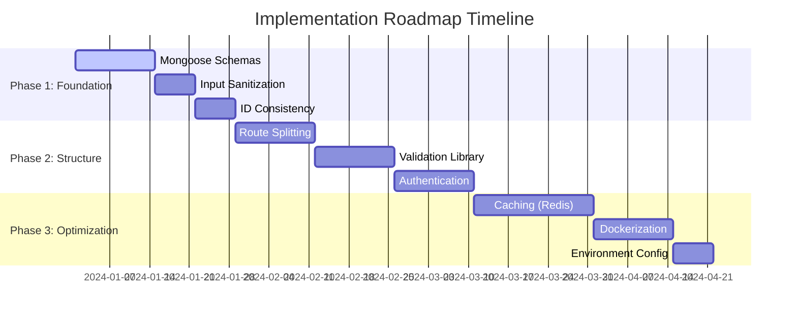

# 🚀 **Requirements Gathering Agent - Implementation Roadmap**

## 📋 **Overview**

This comprehensive implementation roadmap provides a structured approach to transforming your Node.js/Express API server from its current state into a production-ready, scalable, and maintainable application. The roadmap is divided into three phases, each building upon the previous one to ensure a solid foundation for future growth.

## 🎯 **Current State Analysis**

Your current `simple-server.ts` (3,635 lines) is a functional API server with:
- ✅ Express.js with MongoDB Atlas integration
- ✅ Comprehensive CRUD operations for templates, projects, feedback, etc.
- ✅ Security middleware (CORS, Helmet, Rate Limiting)
- ✅ Analytics and real-time activity tracking
- ✅ Recently resolved TypeScript errors (199 → 0)

**Areas for Improvement:**
- 🔧 Monolithic server file structure
- 🔧 Lack of proper data validation
- 🔧 Missing authentication/authorization
- 🔧 No caching layer
- 🔧 Limited deployment options

---

## 📅 **Implementation Phases**

### **Phase 1: Foundation** (2-4 weeks)
**Build upon your recent TypeScript success**

| Priority | Task | Effort | Impact | Status |
|----------|------|--------|--------|--------|
| 🔥 HIGH | Mongoose Schemas | Medium | High | Ready |
| 🔥 HIGH | Input Sanitization | Medium | High | Ready |
| 🔥 HIGH | `_id` Consistency | Low | Medium | Ready |

**Key Benefits:**
- Type-safe data models
- Security hardening
- Bug prevention
- Foundation for growth

### **Phase 2: Structure** (4-6 weeks)
**Professional codebase organization**

| Priority | Task | Effort | Impact | Status |
|----------|------|--------|--------|--------|
| 🔥 HIGH | Route Splitting | Medium | High | Ready |
| 🔥 HIGH | Validation Library | Medium | High | Ready |
| 🔥 HIGH | Authentication | High | High | Ready |

**Key Benefits:**
- Maintainable codebase
- Robust validation
- Production security
- Team collaboration ready

### **Phase 3: Optimization** (4-6 weeks)
**Production-ready performance**

| Priority | Task | Effort | Impact | Status |
|----------|------|--------|--------|--------|
| 🟡 MEDIUM | Caching (Redis) | High | High | Ready |
| 🟡 MEDIUM | Dockerization | Medium | Medium | Ready |
| 🟠 LOW | Environment Config | Low | Medium | Ready |

**Key Benefits:**
- High performance
- Easy deployment
- Operational excellence
- Scalability ready

---

## 🗂️ **Documentation Structure**

```
docs/implementation-roadmap/
├── README.md                           # This overview document
├── PHASE-1-FOUNDATION.md              # Foundation implementation guide
├── PHASE-2-STRUCTURE.md               # Structure implementation guide
├── PHASE-3-OPTIMIZATION.md            # Optimization implementation guide
└── templates/                          # Implementation templates
    ├── mongoose-schemas/               # Schema templates
    ├── middleware/                     # Middleware templates
    ├── validation/                     # Validation templates
    └── docker/                         # Docker templates
```

---

## 🎯 **Success Metrics**

### **Technical Metrics**
- **TypeScript Errors:** 0 (✅ Already achieved)
- **Server File Size:** <500 lines (from 3,635)
- **Response Times:** <200ms average
- **Cache Hit Ratio:** >80%
- **Test Coverage:** >80%

### **Quality Metrics**
- **Code Maintainability:** Significantly improved
- **Security Posture:** Production-ready
- **Error Handling:** Consistent across all endpoints
- **Documentation:** Comprehensive and up-to-date

### **Business Metrics**
- **Developer Productivity:** Easier to work on features
- **Deployment Time:** <5 minutes
- **Uptime:** 99.9%+
- **Scalability:** Ready for team growth

---

## 🚀 **Getting Started**

### **Prerequisites**
- Node.js 18+
- MongoDB Atlas account
- Redis instance (for Phase 3)
- Docker (for Phase 3)

### **Quick Start**
1. **Review Phase 1 documentation** - Start with Mongoose schemas
2. **Set up development environment** - Follow the setup guides
3. **Begin with Template schema** - Build on existing work
4. **Test incrementally** - Ensure no regressions

### **Recommended Approach**
1. **Start with Phase 1** - Builds on your recent TypeScript success
2. **Complete each phase fully** - Don't skip ahead
3. **Test thoroughly** - Ensure no functionality is lost
4. **Document changes** - Keep team informed

---

## ⚠️ **Risk Management**

### **Identified Risks**
- **Breaking existing functionality** during refactoring
- **Performance impact** from validation and caching
- **Learning curve** for new technologies
- **Team coordination** during implementation

### **Mitigation Strategies**
- **Comprehensive testing** at each step
- **Gradual rollout** with feature flags
- **Team training** and documentation
- **Performance monitoring** throughout

---

## 📊 **Implementation Timeline**



---

## 🎉 **Expected Outcomes**

### **After Phase 1**
- ✅ Type-safe data models
- ✅ Secure input handling
- ✅ Consistent data management
- ✅ Foundation for growth

### **After Phase 2**
- ✅ Maintainable codebase
- ✅ Robust validation
- ✅ Production authentication
- ✅ Team-ready structure

### **After Phase 3**
- ✅ High-performance caching
- ✅ Containerized deployment
- ✅ Environment management
- ✅ Production-ready application

---

## 📞 **Support & Resources**

### **Documentation**
- Each phase has detailed implementation guides
- Code examples and templates provided
- Best practices and patterns included

### **Community**
- GitHub issues for questions
- Team collaboration tools
- Regular progress reviews

### **Tools & Technologies**
- **Phase 1:** Mongoose, express-validator, express-sanitizer
- **Phase 2:** Joi, Passport.js, JWT
- **Phase 3:** Redis, Docker, Config

---

## 🎯 **Next Steps**

1. **Review Phase 1 documentation** - Understand the foundation approach
2. **Set up development environment** - Prepare for implementation
3. **Start with Mongoose schemas** - Build on your TypeScript success
4. **Follow the implementation guides** - Step-by-step instructions
5. **Test and validate** - Ensure no regressions

---

## 📝 **Notes**

- **Build on Success:** Phase 1 leverages your recent TypeScript victory
- **Incremental Approach:** Each phase builds upon the previous one
- **Production Ready:** Final result meets industry standards
- **Team Friendly:** Structure supports team collaboration
- **Scalable:** Architecture ready for future growth

---

**Ready to begin? Start with [Phase 1: Foundation](./PHASE-1-FOUNDATION.md) and build upon your recent success!** 🚀
