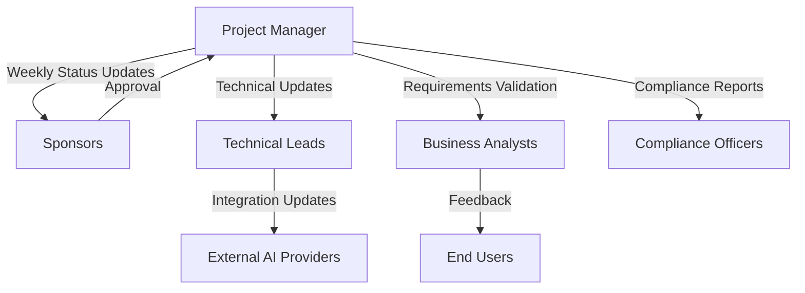

# Communication Management Plan

**Generated by Requirements Gathering Agent v2.1.2**  
**Category:** management-plans  
**Generated:** 2025-06-09T21:39:04.369Z  
**Description:** PMBOK Communication Management Plan

---

# Communication Management Plan for Requirements Gathering Agent Project  

---

## 1. Introduction  

### Purpose  
The purpose of this Communication Management Plan is to establish a framework for managing project communications for the Requirements Gathering Agent project. This plan ensures timely and effective communication among all stakeholders, facilitates project alignment, and supports successful project delivery by adhering to PMBOK standards.  

---

## 2. Stakeholder Communication Requirements  

### Stakeholder Groups  
| Stakeholder Group                 | Communication Needs                                                                 |
|-----------------------------------|------------------------------------------------------------------------------------|
| **Project Team**                  | Regular updates on progress, technical challenges, and task assignments.          |
| **Product Owner**                 | Status reports, milestone achievements, and feature delivery updates.             |
| **End Users**                     | User guides, tutorials, and feedback channels for generated project documents.     |
| **Business Analysts**             | Requirements validation, stakeholder feedback, and generated document reviews.     |
| **Compliance Officers**           | PMBOK compliance validation reports and risk management updates.                  |
| **Sponsors**                      | High-level project progress and financial performance updates.                    |
| **Technical Leads**               | Architecture design updates, system integration progress, and technical risks.     |
| **External AI Providers**         | Issue reporting, API usage updates, and integration challenges.                   |

### Communication Objectives  
1. Ensure all stakeholders are informed of project updates and outcomes.  
2. Facilitate collaboration and feedback to improve the project deliverables.  
3. Maintain transparency in progress, risks, and decisions.  

---

## 3. Information to Be Communicated  

### Types of Information  
1. **Project Progress**  
   - Milestone achievements  
   - Weekly status updates  
   - Planned vs. actual progress  
2. **Technical Updates**  
   - Architecture changes  
   - AI provider integration progress  
   - Bug fixes and resolutions  
3. **Generated Documentation**  
   - Completed PMBOK-compliant documents  
   - Validation reports and quality assessments  
   - Feedback on document usability  
4. **Risks and Issues**  
   - Identified risks and mitigation plans  
   - Technical challenges impacting timelines  
   - Stakeholder concerns  
5. **Financial Reports**  
   - Budget utilization reports  
   - Cost control updates  

---

## 4. Communication Methods and Technologies  

### Methods  
| Communication Type       | Format                     | Technology/Tool                      |
|--------------------------|----------------------------|--------------------------------------|
| **Status Updates**       | Email, Slack, Dashboard    | Slack, Azure DevOps, Google Workspace |
| **Technical Discussions**| Virtual Meetings           | Microsoft Teams, Zoom                |
| **Document Reviews**     | Shared Documents           | Google Drive, GitHub                 |
| **Progress Reports**     | PDF/Markdown Reports       | Azure DevOps, GitHub Pages           |
| **Risk Management**      | Risk Matrix, Presentations | Google Slides, Microsoft Excel       |
| **Milestone Announcements** | Email, Slack Message   | Slack, Google Workspace              |

### Technologies Used  
- **Collaboration Tools**: Slack, Microsoft Teams  
- **Document Management**: Google Drive, GitHub  
- **Reporting and Tracking**: Azure DevOps, Jira  
- **Virtual Meetings**: Zoom, Microsoft Teams  

---

## 5. Communication Flow Diagram  

---

## 6. Communication Constraints  

1. **Time Zones**: Stakeholders across different time zones require flexible scheduling.  
2. **Technology Limitations**: Compatibility issues with AI providers and communication tools.  
3. **Confidentiality**: Sensitive project data must be protected through secure channels.  
4. **Bandwidth**: Limited availability of certain stakeholders during peak periods.  

---

## 7. Communication Schedule and Frequency  

### Schedule  
| Communication Type              | Frequency             | Participants                     |
|---------------------------------|-----------------------|----------------------------------|
| **Weekly Status Update**        | Weekly (Monday)       | Project Team, Sponsors          |
| **Technical Sync**              | Bi-weekly (Wednesday) | Project Team, Technical Leads   |
| **Document Review Session**     | Monthly               | Business Analysts, End Users    |
| **Risk Management Discussion**  | Monthly (Last Friday) | Compliance Officers, Sponsors   |
| **Milestone Announcement**      | As Achieved           | All Stakeholders                |

---

## 8. Roles and Responsibilities  

| Role                     | Responsibility                                                   |
|--------------------------|-------------------------------------------------------------------|
| **Project Manager**      | Ensuring timely communication, managing stakeholder conflicts.   |
| **Technical Lead**       | Providing technical updates, resolving integration issues.       |
| **Business Analyst**     | Collecting requirements feedback, validating generated documents.|
| **Compliance Officer**   | Reviewing PMBOK compliance and regulatory standards.             |
| **Sponsors**             | Approving milestone updates and funding adjustments.             |

---

## 9. Communication Approval Process  

1. Draft communication messages or reports.  
2. Review content with the Project Manager and relevant stakeholders.  
3. Obtain approval from the Project Sponsors for milestone updates or sensitive communications.  
4. Distribute the communication via appropriate channels.  

---

## 10. Communication Storage, Retrieval, and Disposal  

### Storage  
- All communications will be stored in **Google Drive** and **Azure DevOps** repositories.  
- Sensitive documents require GitHub private repositories with restricted access.  

### Retrieval  
- Stakeholders can access communication archives via the shared project directories.  

### Disposal  
- Dispose of outdated communications post-project closure using secure deletion tools.  

---

## 11. Glossary of Terms  

- **PMBOK**: Project Management Body of Knowledge  
- **CLI**: Command-Line Interface  
- **Azure DevOps**: Microsoft platform for project management and CI/CD pipelines  

---

## 12. Communication Matrix  

| Stakeholder            | Information Type         | Frequency            | Format                | Delivery Method      |
|-------------------------|--------------------------|-----------------------|-----------------------|----------------------|
| **Sponsors**           | Milestone Updates        | Monthly              | PDF                   | Email, Slack         |
| **Project Team**       | Weekly Progress          | Weekly               | Markdown Report       | Slack, Azure DevOps  |
| **Technical Leads**    | Technical Issues         | Bi-weekly            | Meeting Agenda        | Microsoft Teams      |
| **End Users**          | Document Feedback        | Monthly              | Shared Document       | Google Drive         |
| **Compliance Officers**| PMBOK Validation Reports | Monthly              | Presentation Slides   | Microsoft Teams      |

---

## 13. Meeting Schedules and Formats  

### Weekly Team Sync  
- **Day**: Monday  
- **Time**: 10:00 AM EST  
- **Format**: 30-minute virtual meeting  

### Bi-Weekly Technical Sync  
- **Day**: Wednesday  
