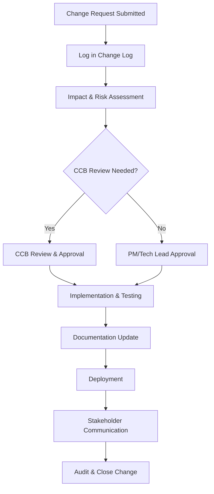

# Perform Integrated Change Control Process

**Generated by adpa-enterprise-framework-automation v3.2.0**  
**Category:** management-plans  
**Generated:** 2025-07-14T21:10:03.579Z  
**Description:** PMBOK Perform Integrated Change Control Process

---

# Perform Integration Change Control Process

**Project:** ADPA - Advanced Document Processing & Automation Framework  
**Version:** 3.2.0  
**Document Owner:** Project Management Office  
**Last Updated:** July 2025

---

## 1. Purpose

This document defines the Perform Integration Change Control Process for the ADPA (Advanced Document Processing & Automation) Framework project. It ensures that all changes to project deliverables, documentation, or baselines are formally evaluated, approved, tracked, and communicated in accordance with PMBOK 7th Edition best practices and enterprise requirements.

---

## 2. Scope

This process applies to all change requests affecting:
- The ADPA codebase (Node.js/TypeScript backend, CLI, REST API)
- Supported standards (BABOK v3, PMBOK 7th, DMBOK 2.0)
- Integration modules (AI providers, Adobe, Confluence, SharePoint, VCS)
- Security/compliance features
- Documentation and configuration artifacts
- Deployment scripts, admin interface, and analytics/reporting modules

---

## 3. Roles & Responsibilities

| Role                       | Responsibility                                                         |
|----------------------------|------------------------------------------------------------------------|
| Project Sponsor            | Final approval for strategic changes and budget-impacting decisions     |
| Project Manager            | Manages the change control process, ensures compliance, logs changes   |
| Change Control Board (CCB) | Reviews, approves/rejects, and prioritizes significant changes         |
| Technical Lead             | Assesses technical impact, risks, and feasibility                      |
| Developers/Contributors    | Submit change requests, provide impact analysis, implement approved    |
| QA/Testing                 | Validates post-change stability and regression coverage                |
| Documentation Lead         | Ensures change tracking in all end-user and technical documentation    |

---

## 4. Change Request Lifecycle

### 4.1 Initiation

- Any stakeholder may submit a Change Request (CR) via:
  - [GitHub Issues](https://github.com/mdresch/requirements-gathering-agent/issues)
  - Internal change request form (for enterprise deployments)
  - Email to project management

### 4.2 Logging

- All CRs are logged in the central Change Log (GitHub Issues or internal system)
- Each CR includes:
  - Title, description, rationale
  - Impacted modules/components
  - Urgency/priority
  - Submitter details

### 4.3 Impact Assessment

- Change is assigned to a Technical Lead and Project Manager for:
  - **Technical Analysis:** Dependencies, integration points (e.g., AI providers, API interfaces, security modules)
  - **Risk Assessment:** Security, compliance (Basel III, GDPR, SOX, PCI DSS), performance, and scalability
  - **Effort Estimation:** Required resources, timeline, and cost
  - **Documentation Impact:** User guides, API specs, compliance records

### 4.4 Change Control Board (CCB) Review

- CCB reviews all significant or high-impact changes (core architecture, compliance, integrations)
- CCB composition: Project Manager, Technical Lead, Compliance Officer, and representatives for each integration domain (e.g., Adobe, SharePoint)
- CCB decisions: Approve, conditionally approve, defer, or reject

### 4.5 Implementation & Testing

- Approved changes are assigned to relevant developers
- Implementation follows code standards (TypeScript strict mode, ESLint, Prettier, conventional commits)
- All changes must:
  - Pass unit, integration, and performance tests (`npm test`, `npm run test:integration`)
  - Include updated documentation (e.g., admin guides, API docs, user help)
  - Be peer-reviewed via Pull Request workflow

### 4.6 Communication

- All stakeholders are notified of approved/rejected changes via:
  - GitHub notifications/discussions
  - Email (for enterprise rollouts)
  - Release notes and documentation updates (see [GitHub Wiki](https://github.com/mdresch/requirements-gathering-agent/wiki))

### 4.7 Deployment

- Changes are merged into the main branch only after passing all quality gates
- For production releases:
  - Update versioning (semantic versioning)
  - Prepare deployment scripts (Docker, Kubernetes, NPM, etc.)
  - Tag release and update change log

---

## 5. Change Control Tools & Artifacts

- **Change Log:** Maintained in GitHub Issues and internal documentation
- **Templates:** Standard CR templates for business, technical, and compliance changes
- **Test Scripts:** Automated via Jest, TypeScript, and integration pipelines
- **Audit Trail:** All changes are auditable via GitHub, including commit history, PRs, and code reviews
- **Documentation:** Must be updated for every approved change (user, admin, compliance, API)

---

## 6. Unique Project Considerations

- **Multi-Framework Integration:** Changes to BABOK, PMBOK, or DMBOK modules may trigger cross-standard review.
- **AI Provider Failover:** Updates impacting AI provider orchestration require regression testing across all supported platforms (OpenAI, Google, Copilot, Ollama, Azure).
- **Enterprise Security & Compliance:** All changes must remain compliant with core industry regulations (GDPR, SOX, PCI DSS, Basel III, MiFID II, FINRA, HIPAA, FedRAMP).
- **Automated Document Generation Pipelines:** Any update to template engines or document workflows (e.g., Adobe, SharePoint integrations) must be tested for end-to-end automation integrity.
- **API-First Architecture:** API changes require OpenAPI spec review and backward compatibility validation.
- **Scalable Microservices:** Infrastructure/architecture changes must consider deployment scalability, load balancing, and monitoring impacts.

---

## 7. Change Control Metrics & KPIs

- **Change Request Throughput:** Number of CRs processed per month
- **Lead Time:** Average time from CR submission to resolution
- **Change Failure Rate:** % of changes causing production issues/rollbacks
- **Compliance Violation Rate:** % of changes flagged for compliance issues
- **Stakeholder Satisfaction:** Feedback gathered post-change deployment

---

## 8. References

- [PMBOK 7th Edition: Perform Integrated Change Control](https://www.pmi.org/pmbok-guide-standards/foundational/pmbok)
- [BABOK v3](https://www.iiba.org/standards-and-resources/babok/)
- [DMBOK 2.0](https://www.dama.org/content/body-knowledge)
- [ADPA Documentation Wiki](https://github.com/mdresch/requirements-gathering-agent/wiki)
- [ADPA Contributing Guide](CONTRIBUTING.md)

---

## 9. Change Control Process Flow (Summary)

---

## 10. Appendix

- **Sample Change Request Template**  
    - Title  
    - Description  
    - Affected Modules  
    - Rationale/Business Case  
    - Impacted Standards (BABOK/PMBOK/DMBOK)  
    - Security/Compliance Considerations  
    - Testing & Documentation Impact  
    - Requested By  
    - Date

- **Contact for Change Requests:**  
    - [menno.drescher@gmail.com](mailto:menno.drescher@gmail.com)  
    - GitHub Issues: [requirements-gathering-agent/issues](https://github.com/mdresch/requirements-gathering-agent/issues)

---

**End of Document**