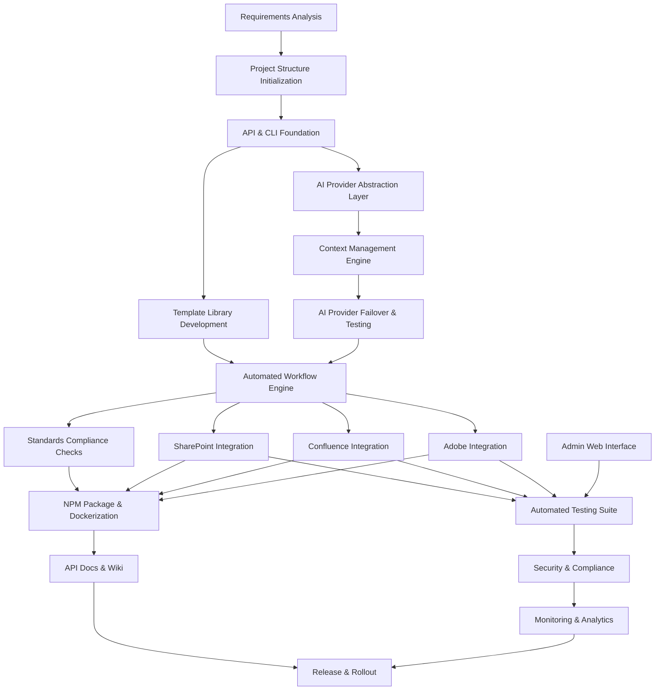

# Schedule Network Diagram

**Generated by adpa-enterprise-framework-automation v3.2.0**  
**Category:** planning  
**Generated:** 2025-07-14T21:23:38.902Z  
**Description:** PMBOK Schedule Network Diagram

---

# Schedulenetworkdiagram

**Project:** ADPA - Advanced Document Processing & Automation Framework  
**Version:** 3.2.0  
**Prepared for:** Project Management, Technical Leads, and Implementation Stakeholders  
**Document Purpose:**  
This document provides a comprehensive schedule network diagram for the ADPA (Advanced Document Processing & Automation Framework) project, outlining activity dependencies, workflow sequencing, critical path considerations, and milestone relationships. The schedule network diagram supports effective project planning, risk management, and resource allocation in line with PMBOK 7th Edition best practices.

---

## 1. Executive Summary

ADPA is a modular, standards-compliant automation platform for AI-powered document generation, project management, and business analysis. It integrates multiple AI providers, supports enterprise standards (BABOK v3, PMBOK 7th, DMBOK 2.0), and features robust REST API and CLI interfaces. Integration with platforms such as SharePoint, Confluence, and Adobe Document Services is core to enterprise readiness.

---

## 2. Methodology

This schedule network diagram follows the precedence diagramming method (PDM), visually and descriptively mapping the sequence and dependencies of major activities. Activities are grouped by core project domains—core framework, AI integration, enterprise integrations, and documentation automation.

---

## 3. Key Activities & Work Packages

### A. Core Framework Setup

- **A1. Requirements Analysis**  
  Define business and technical requirements; identify standards to support (BABOK, PMBOK, DMBOK).
- **A2. Project Structure Initialization**  
  Setup source code repo, base directory structure, and configuration files.
- **A3. API & CLI Foundation**  
  Scaffold Express.js REST API and CLI (Yargs-based); ensure TypeScript strict mode.

### B. AI Integration

- **B1. Provider Abstraction Layer**  
  Implement interfaces for OpenAI, Google AI, GitHub Copilot, Ollama, Azure OpenAI.
- **B2. Context Management Engine**  
  Build context injection, provider fallback, and intelligent routing logic.
- **B3. AI Provider Failover & Testing**  
  Develop and test automatic failover between providers.

### C. Document Generation & Standards Compliance

- **C1. Template Library Development**  
  Build and validate templates for BABOK v3, PMBOK 7th, DMBOK 2.0.
- **C2. Automated Workflow Engine**  
  Orchestrate end-to-end document generation pipelines.
- **C3. Standards Validation & Compliance Checks**  
  Ensure output meets industry standards (e.g., regulatory, financial, security).

### D. Enterprise Integration

- **D1. SharePoint Integration**  
  Implement Microsoft Graph API-based document publishing, metadata tagging, and folder management.
- **D2. Confluence Integration**  
  Enable OAuth2 authentication and direct publishing to Atlassian Confluence.
- **D3. Adobe Document Services Integration**  
  Integrate PDF, InDesign, Illustrator, and Photoshop APIs for advanced document output.

### E. User Interface & Administration

- **E1. Admin Web Interface**  
  Setup Next.js portal for admin and user management.
- **E2. Real-time Collaboration Features**  
  (Future) Implement WebSocket-based concurrent editing and approval workflows.

### F. Testing, Security, and Compliance

- **F1. Automated Testing Suite**  
  Configure Jest/unit/integration/performance tests.
- **F2. Security & Compliance Implementation**  
  Apply authentication, authorization, and regulatory compliance (GDPR, SOX, PCI DSS).
- **F3. Monitoring & Analytics**  
  Instrument usage, error, and performance metrics.

### G. Packaging, Deployment, and Documentation

- **G1. NPM Package & Dockerization**  
  Prepare npm module, build scripts, and Docker images.
- **G2. API Documentation & Wiki**  
  Generate OpenAPI specifications, publish to Swagger UI and project Wiki.
- **G3. Release & Rollout**  
  Tag releases, push to npm, and coordinate production deployment.

---

## 4. Activity Dependencies & Precedence Relationships

Below is a high-level illustration of the dependencies (FS: Finish-to-Start, SS: Start-to-Start, FF: Finish-to-Finish, SF: Start-to-Finish):

**Key:**
- All core setup (A1-A3) is prerequisite for advanced integration and generation.
- AI integration and document automation proceed in parallel after foundations are built.
- Enterprise integrations (SharePoint, Confluence, Adobe) depend on core document workflow readiness.
- Testing and security run concurrently and iteratively as new modules are integrated.
- Packaging and documentation are dependent on functional and compliance completion.

---

## 5. Critical Path Activities

The following path will typically determine the minimum project duration (critical path):

1. Requirements Analysis (A1)
2. Project Structure Initialization (A2)
3. API & CLI Foundation (A3)
4. AI Provider Abstraction Layer (B1)
5. Context Management Engine (B2)
6. AI Provider Failover & Testing (B3)
7. Template Library Development (C1)
8. Automated Workflow Engine (C2)
9. Standards Validation & Compliance Checks (C3)
10. Automated Testing Suite (F1)
11. Security & Compliance Implementation (F2)
12. Packaging, Deployment, and Documentation (G1, G2)
13. Release & Rollout (G3)

Delays in any of these activities will directly impact the overall timeline.

---

## 6. Milestones

- **M1:** Requirements & Architecture Approved  
- **M2:** API & CLI MVP Complete  
- **M3:** Multi-Provider AI Support Functional  
- **M4:** BABOK/PMBOK/DMBOK Templates Released  
- **M5:** SharePoint/Confluence/Adobe Integrations Complete  
- **M6:** Security & Compliance Certified  
- **M7:** Production Release

---

## 7. Unique Considerations for ADPA

- **Multi-Provider AI Orchestration:** Requires robust failover and real-time context adaptation.
- **Standards-Driven Document Generation:** Cross-framework compliance (BABOK, PMBOK, DMBOK) is a must.
- **Enterprise Integration:** Deep coupling with SharePoint, Confluence, and Adobe APIs.
- **API-First Design:** OpenAPI/TypeSpec-driven development for extensibility and automation.
- **Security & Compliance:** Regulatory support for financial, healthcare, and government sectors.
- **Modular, Extensible Architecture:** Enables customization per enterprise use case.

---

## 8. Practical Guidance

- **Parallelization:** Where possible, develop AI provider integrations and document templates in parallel.
- **Integration Testing:** Leverage automated test suites as soon as each integration is merged.
- **Stakeholder Reviews:** Schedule milestone-based reviews to ensure compliance and gather feedback early.
- **Documentation First:** Maintain up-to-date API and user documentation to reduce onboarding friction.
- **Release Management:** Use npm and Docker releases for predictable deployment and rollback.

---

## 9. Diagram Legend

| Symbol      | Meaning                                 |
|-------------|-----------------------------------------|
|  -->        | Finish-to-Start dependency              |
| [Activity]  | Work package or major deliverable       |
| *           | Critical Path Activity                  |

---

## 10. Appendix: References

- [PMBOK 7th Edition](https://www.pmi.org/pmbok-guide-standards/foundational/pmbok)
- [BABOK v3](https://www.iiba.org/business-analysis-body-of-knowledge/)
- [DMBOK 2.0](https://www.dama.org/cpages/body-of-knowledge)
- [ADPA Documentation](https://github.com/mdresch/requirements-gathering-agent/wiki)
- [API Docs (Swagger UI)](http://localhost:3000/api-docs)

---

**For questions or feedback, please contact the ADPA project team or consult the project Wiki.**