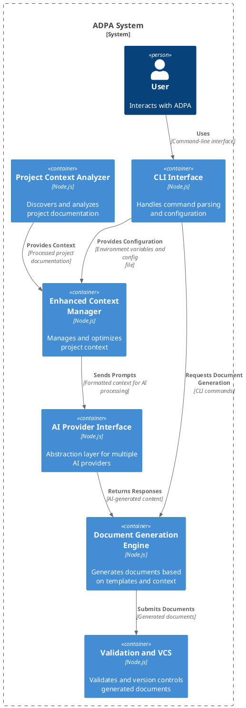

# ArchitectureDesign

**Generated by Requirements Gathering Agent v2.1.2**  
**Category:** technical-design  
**Generated:** 2025-06-17T09:19:52.479Z  
**Description:** 

---

# Architecture Design Document

**Project Name:** ADPA - Automated Documentation Project Assistant

**Document Version:** 1.0
**Date:** October 26, 2023
**Author:** AI-Generated (Based on provided README)

## 1. Introduction

This document outlines the system architecture for the Automated Documentation Project Assistant (ADPA), formerly known as the Requirements Gathering Agent. ADPA is a command-line interface (CLI) tool that leverages AI to generate comprehensive project management documentation based on project context derived from various sources, including but not limited to the project's README file.  The system is designed to be modular, scalable, and extensible, supporting multiple AI providers and adhering to PMBOK 7.0 standards.  A key differentiator is the Enhanced Context Manager, which significantly improves the quality and accuracy of the generated documentation by maximizing context utilization for large language models (LLMs).

## 2. System Overview

ADPA's primary function is automated generation of project management documents. This includes a complete PMBOK 7.0 document suite, strategic business documents (e.g., purpose statements, company values), and a comprehensive set of technical design documents. The system operates in three main phases:

1. **Project Context Analysis:**  This phase involves intelligently discovering and analyzing all relevant project documentation, scoring the relevance of each source, and building a comprehensive context representation.
2. **Context Management:** The Enhanced Context Manager intelligently manages and optimizes the project context for different AI models, maximizing token utilization.  This phase includes features for advanced reporting and analytics on context usage.
3. **Document Generation:**  This phase utilizes selected AI models to generate documents based on the prepared context and pre-defined templates.  The generated documents are then validated against PMBOK 7.0 standards and undergo a quality assessment.  A built-in Version Control System tracks all changes.

## 3. Architectural Principles

* **Modularity:** ADPA employs a modular architecture with independent processors for each document type.  This allows for easy extension and maintenance.  New document types can be added without modifying core system components.
* **Extensibility:** The system is designed to support multiple AI providers (Azure OpenAI, Google AI, GitHub AI, Ollama) through an abstraction layer.  New providers can be integrated with minimal code changes.
* **Scalability:** The system is designed to handle large projects with extensive documentation and complex relationships. The Enhanced Context Manager dynamically adjusts to the capabilities of different AI models.
* **Maintainability:**  The use of TypeScript ensures type safety and improves code readability, making the system easier to maintain and debug.  Comprehensive unit and integration tests are implemented.
* **Reliability:** Robust error handling and retry mechanisms ensure system stability even in case of API failures or unexpected input.  A version control system tracks changes and allows for rollbacks.
* **PMBOK Compliance:**  The system is designed to generate documents that adhere to PMBOK 7.0 standards.  Built-in validation ensures compliance.

## 4. System Architecture

ADPA follows a layered architecture:

**Layer 1: CLI Interface and Configuration:**  The user interacts with the system via a CLI.  Configuration is managed through a `.env` file and a `config-rga.json` file.  This layer handles command parsing, option processing, and input validation.

**Layer 2: Project Context Analyzer:** This layer is responsible for discovering, analyzing, and scoring all relevant project documentation.  It uses a combination of file system traversal, regular expressions, and keyword analysis to identify and prioritize relevant information.

**Layer 3: Enhanced Context Manager:** This is the core of ADPA. It takes the output from the Analyzer, intelligently summarizes and organizes the context, and adapts it to the chosen AI provider and model. This layer includes strategies for optimizing context size for different model capabilities.

**Layer 4: AI Provider Interface:** This layer provides an abstraction over multiple AI providers.  This allows the system to seamlessly switch between providers without requiring significant code changes.  It handles API calls, authentication, and error handling.

**Layer 5: Document Generation Engine:** This layer uses the context from the Context Manager and pre-defined templates to generate documents.  Each document type has a dedicated processor.

**Layer 6: Validation and Version Control:**  Generated documents undergo validation against PMBOK 7.0 standards and a quality assessment. The built-in VCS manages version history.

## 5. Component Diagram

## 6. Technology Stack

* **Programming Language:** TypeScript
* **Runtime Environment:** Node.js
* **Framework:**  None (custom implementation)
* **Testing Framework:** Jest
* **AI Providers:** Azure OpenAI, Google AI, GitHub AI, Ollama (configurable)
* **Database:**  None (file system based)
* **Version Control:** Git (integrated)

## 7. Data Flow

1. The user provides commands via the CLI.
2. The CLI passes configuration and commands to the Context Manager.
3. The Project Context Analyzer scans the project's file system, identifies relevant documents, and scores their relevance.
4. The Enhanced Context Manager receives this data, summarizes and prioritizes information, and prepares the context for the chosen AI provider.
5. The AI Provider Interface sends prompts to the selected AI provider's API.
6. The AI provider returns the generated content.
7. The Document Generation Engine uses this content and templates to create the final documents.
8. The Validation and VCS layer validates the documents against PMBOK standards, performs a quality assessment, and commits the changes to the local Git repository.

## 8. Deployment Architecture

ADPA is designed to be deployed as a standalone CLI tool. It can be installed globally using npm or run directly with `npx`.  No server-side components are required.

## 9. Future Considerations

* **Improved Context Summarization:** Explore more sophisticated techniques for summarizing large amounts of text, potentially leveraging AI for more nuanced summarization.
* **Advanced Contextual Relationships:** Develop more sophisticated methods to understand relationships between different documents and incorporate this knowledge into the context.
* **Parallel Processing:**  Implement parallel processing capabilities for faster document generation, particularly for larger projects.
* **GUI Development:** Consider developing a graphical user interface (GUI) for improved user experience.
* **Integration with Existing PM Tools:** Integrate ADPA with popular project management tools to streamline workflows.

This architecture design provides a solid foundation for ADPA's continued development and expansion. The modular and extensible nature of the system allows for easy adaptation to evolving needs and integration with new technologies.
