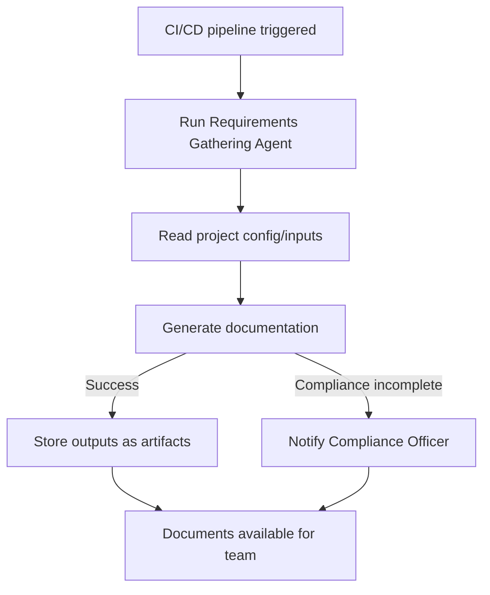
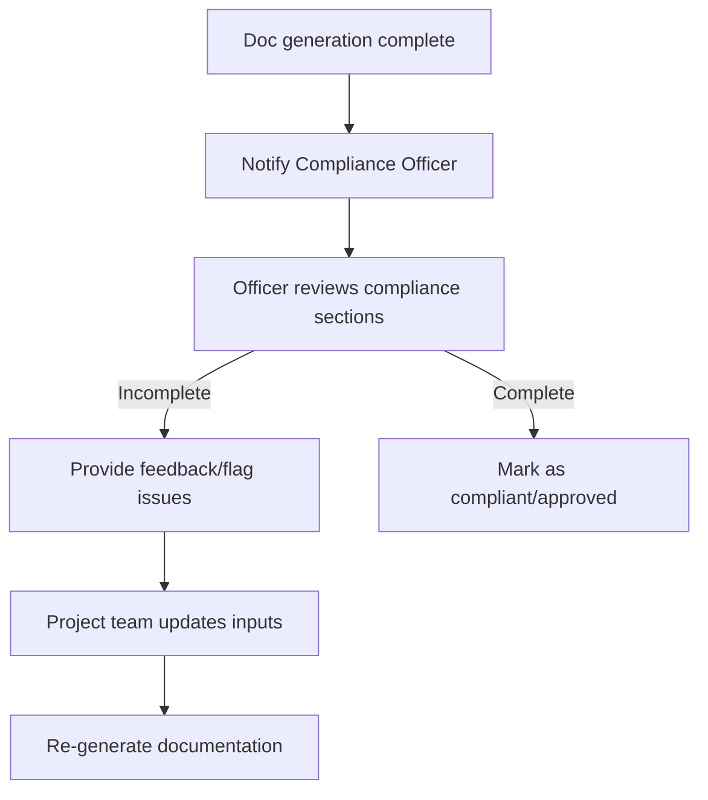

# AI-Generated Process Flow Suggestions

Certainly! Based on your project context, user stories, and roles, here are **2-3 key high-level user flows/system processes** for the Requirements Gathering Agent, with step-by-step textual descriptions and Mermaid.js flowcharts.

---

## Key Process Flow 1: **Automated Project Documentation Generation (via CLI or API)**

### Textual Description

**This flow covers how a user (Project Manager, Developer, or Integrator) generates PMBOK-compliant documentation using the Requirements Gathering Agent, either via CLI or API.**

1. **User Initiates Documentation Generation**
   - The user (Project Manager, Developer, or Integrator) triggers the agent, either through the CLI or by calling the API in a Node.js/TypeScript project.

2. **User Provides Project Inputs**
   - The user supplies required project details (e.g., project name, goals, stakeholders, constraints, requirements, etc.) via command-line prompts, configuration files, or API payload.

3. **Agent Validates Inputs**
   - The agent checks for completeness and validity of the provided inputs (e.g., mandatory fields, valid formats).

4. **Azure AI Analysis & Document Generation**
   - The agent leverages Azure AI to analyze inputs, generate PMBOK-aligned documentation sections, and provide intelligent recommendations (e.g., technology stack, risk identification).

5. **Compliance & Quality Checks**
   - The agent ensures that compliance, risk, and quality management sections are included and complete.

6. **Output Generation**
   - The agent produces structured documentation outputs (JSON and/or human-readable formats) and stores them in the specified location.

7. **User Reviews & Customizes (Optional)**
   - The user reviews generated documents and can provide further input or customizations if needed, then re-runs the generation process as desired.

---

### Mermaid Flowchart

```mermaid
graph TD
    A[Start: User triggers agent (CLI/API)] --> B[Provide project inputs]
    B --> C[Validate inputs]
    C -- Invalid/Missing --> B
    C -- Valid --> D[Azure AI analyzes & generates docs]
    D --> E[Compliance & quality checks]
    E -- Incomplete --> F[Notify user of missing sections]
    F --> B
    E -- Complete --> G[Generate structured outputs]
    G --> H[User reviews/customizes (optional)]
    H -- Further edits --> B
    H -- Satisfied --> I[End]
```

---

## Key Process Flow 2: **Integration into CI/CD Pipeline for Automated Documentation**

### Textual Description

**This flow illustrates how an Integrator/DevOps Engineer automates documentation generation as part of the CI/CD process.**

1. **Integrator Configures CI/CD Pipeline**
   - The Integrator adds a step in the pipeline configuration (e.g., GitHub Actions, Azure Pipelines) to invoke the Requirements Gathering Agent via CLI or script.

2. **Pipeline Triggers Documentation Generation**
   - On predefined events (e.g., code push, PR merge), the CI/CD pipeline executes the documentation generation step.

3. **Agent Runs Non-Interactively**
   - The agent reads project inputs from configuration files or environment variables (no manual intervention).

4. **Documentation Generated & Stored**
   - The agent produces PMBOK-compliant documentation and stores outputs (e.g., in artifacts directory, cloud storage, or as pipeline artifacts).

5. **Notifications & Compliance Checks**
   - The pipeline can notify relevant users (e.g., Compliance Officer) if compliance sections are missing or incomplete, or if generation fails.

6. **Outputs Available for Team**
   - Generated documents are accessible to stakeholders for review, sharing, or archiving.

---

### Mermaid Flowchart



---

## Key Process Flow 3: **Compliance Review and Alerting**

### Textual Description

**This flow focuses on the Compliance Officer’s interaction with the system to review and verify documentation for compliance.**

1. **Compliance Officer Receives Notification**
   - The Compliance Officer is notified (automatically, via email or dashboard) when new documentation is generated or when compliance sections are missing/incomplete.

2. **Officer Accesses Documentation**
   - The officer accesses the generated documentation (via shared folder, dashboard, or download link).

3. **Review of Compliance Sections**
   - The officer reviews risk management, quality management, and compliance sections for completeness and accuracy.

4. **Feedback or Approval**
   - If documentation is incomplete, the officer provides feedback or flags issues for correction.
   - If complete, the officer marks the documentation as compliant/approved.

5. **Loop for Corrections**
   - If corrections are needed, the Project Manager or Developer updates project inputs and re-generates documentation.

---

## Summary Table

| Process Name                                    | Main Users                         | Description                                                                 |
|-------------------------------------------------|------------------------------------|-----------------------------------------------------------------------------|
| Automated Project Documentation Generation      | Project Manager, Developer, Integrator | End-to-end process for generating PMBOK-compliant docs via CLI/API          |
| Integration into CI/CD for Automated Docs       | Integrator/DevOps Engineer         | Automating doc generation as part of build pipelines                        |
| Compliance Review and Alerting                  | Compliance Officer                 | Reviewing docs for regulatory completeness and issuing alerts if needed      |

---

## (Optional) Flowchart for Compliance Review



---

**Let me know if you need further detail on any process, or wish to see UI wireframes or data models for any of these flows!**