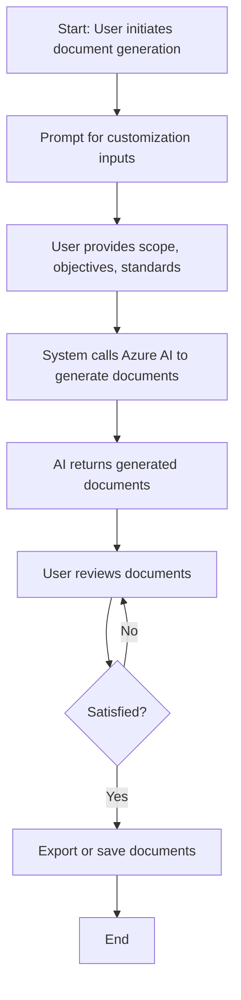
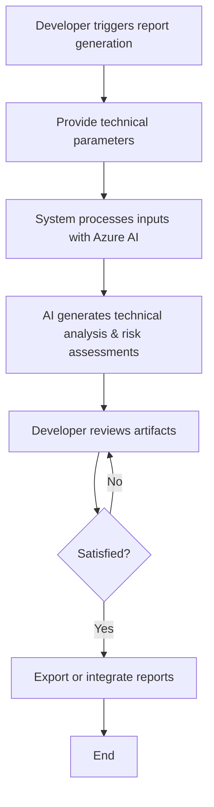

# AI-Generated Process Flow Suggestions

Based on the project context, user stories, and key roles, here are the key high-level user flows and system processes:

---

### **1. Generate and Customize Project Management Documentation**

**High-Level User Flow:**
- Project Manager initiates documentation generation.
- The system prompts for customization options (scope, objectives, standards).
- AI engine generates the documentation artifacts.
- User reviews and optionally modifies the generated documents.
- Final documents are exported or stored for sharing.

---

### **2. Technical Analysis and Artifact Generation by Developers**

**High-Level User Flow:**
- Developer triggers technical report generation via CLI or integrated tool.
- The system collects project parameters and technical requirements.
- AI generates technical analysis, risk assessments, and requirements.
- Developer reviews and integrates artifacts into project workflows.
- Artifacts are exported or stored for further use.

---

### **3. Integration into CI/CD Pipelines and Deployment**

**High-Level User Flow:**
- DevOps engineer configures the system within the CI/CD pipeline.
- The pipeline triggers documentation generation at specific stages (e.g., post-build).
- The system authenticates with Azure AI, generates necessary documents.
- Generated documentation is automatically stored or deployed as part of the pipeline.
- The process repeats with each build/update to keep documentation current.

---

## Step-by-step Descriptions

### **Process 1: Generating and Customizing Project Management Documents**

1. **Initiate Generation:**  
   The Project Manager accesses the system interface (web or CLI) and selects "Generate Project Management Plan."

2. **Input Customization:**  
   The system prompts for project-specific inputs: scope, objectives, stakeholder info, standards, and templates.

3. **AI Document Creation:**  
   Using Azure AI, the system processes inputs and generates comprehensive project management documents aligned with PMBOK standards.

4. **Review & Edit:**  
   The Project Manager reviews the generated documents within the interface, making edits if necessary.

5. **Export & Save:**  
   Finalized documents are exported in preferred formats (PDF, Word) or stored in the system for sharing.

---

### **Process 2: Technical Analysis Report Generation**

1. **Trigger Generation:**  
   A Developer runs a CLI command or uses an integrated tool to request technical analysis.

2. **Provide Parameters:**  
   The system prompts for technical details: requirements, risk factors, technical constraints.

3. **AI Processing:**  
   Azure AI processes the inputs and generates detailed technical reports, including risk assessments and requirements documentation.

4. **Review & Integration:**  
   The Developer reviews the artifacts, making adjustments if needed, then incorporates them into the project documentation or planning.

5. **Export & Storage:**  
   The reports are exported or stored for reference and further analysis.

---

### **Process 3: Automated Documentation in CI/CD Pipelines**

1. **Pipeline Configuration:**  
   DevOps sets up the system within the CI/CD pipeline, configuring triggers (e.g., after build completion).

2. **Authentication & Setup:**  
   The system authenticates with Azure AI securely, using API keys or OAuth.

3. **Documentation Generation:**  
   Upon trigger, the system automatically generates updated project artifacts or plans based on current project data.

4. **Artifact Storage/Deployment:**  
   Generated documents are stored in repositories, dashboards, or deployed to stakeholder portals.

5. **Repeat & Maintain:**  
   The process repeats with each pipeline run, ensuring documentation stays current.

---

## Mermaid.js Flowcharts

### **Flowchart for "Generating and Customizing Project Management Documents"**

---

### **Flowchart for "Technical Analysis Report Generation"**

---

**Summary:**  
These processes encapsulate the core workflows of the Requirements Gathering Agent, supporting project documentation automation, technical analysis, and seamless integration into development pipelines, aligned with user needs and organizational standards.